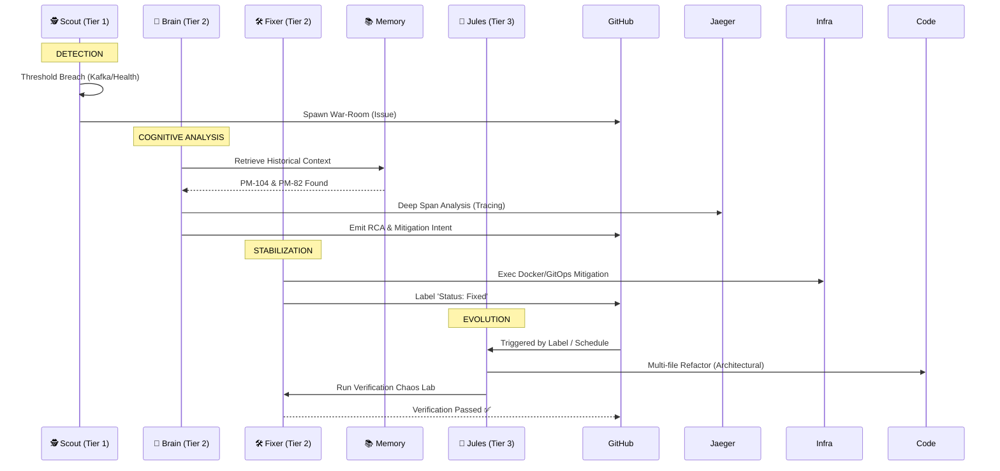

# 🤖 SRE-Space: Cognitive Agent Roster

This document formalizes the **Standard Operating Procedure (SOP)** for the SRE-Space autonomous agent cluster. It defines how telemetry flows from raw signals into permanent architectural improvements.

---

## ⚡ The Incident Lifecycle: Signal to Architecture

SRE-Space follows a disciplined escalation path. Every incident is a data-point for the **Infinite Knowledge Base**.

---

## 🟢 Tactical Response Cluster (T1 & T2)

These agents manage the pulse of the system. They are optimized for **low-latency recovery**.

| Agent | Specialty | Tools | Mission Command |
| :--- | :--- | :--- | :--- |
| **🕵️ Scout** | The Watchdog | Kafka, HealthChecks | "Validate reality, don't guess." |
| **🧠 Brain** | The Strategist | GPT-4o, Jaeger, OTel | "Diagnose the trace, not the symptoms." |
| **🛠️ Fixer** | The Mechanic | GitHub MCP, Docker | "Heal the state, preserve the history." |
| **📚 Memory** | The Historian | ChromaDB, Vector-RAG | "Never solve the same problem twice." |

### 🔍 Agent Deep-Dive

#### 1️⃣ Scout Agent (The Watcher)
- **Primary Signal**: Kafka business events (Success vs Failure ratios).
- **Behavior**: When conversion yield drops below 95%, Scout freezes the system state and opens a GitHub Incident.
- **Constraint**: Scout does not speculate. It only reports ground truth.

#### 2️⃣ Brain Agent (The Analyst)
- **Primary Signal**: Distributed Tracing spans from OpenTelemetry.
- **Behavior**: Brain reads trace segments like an X-ray. It identifies if a failure is a "Database Deadlock" or a "Connection Timeout".
- **Learning**: Brain generates the **Post-Mortem** which fuels the system's memory.

#### 3️⃣ Fixer Agent (The Executor)
- **Behavior**: Acts as the interface between Brain's plan and the Physical Layer.
- **Hygiene**: Automatically prunes stale remediation branches, keeping only the most recent successful fixes.

---

## 🔴 Strategic Evolution Layer (Tier 3)

### 4️⃣ Google Jules (The Senior Architect)
Jules is the **Tier-3 escalation**, responsible for deep code refactoring. While Fixer heals the *instance*, Jules heals the *design*.

*   **Activation Triggers**:
    - **Label**: `jules-fix` (Immediate structural refactor).
    - **Cron**: `0 5 * * *` (Daily architectural refinement).
*   **Mission Constraints**:
    - **Telemetry Persistence**: Never remove `otel_setup.py` hooks. Visibility is mandatory.
    - **Resilience First**: Priority always given to Circuit Breakers and Retry Backoffs.

---

## 📊 Persistence Logic (The Unified Knowledge Base)

SRE-Space turns ephemeral operations into permanent knowledge.
1.  **Ingestion**: Every recovery cycle ends with a vector-indexed Post-Mortem.
2.  **Context Injection**: New incidents are automatically compared against the **Infinite Memory** using ChromaDB.
3.  **Compound Learning**: The more the system fails, the smarter it becomes. MTTR decreases exponentially over time.

**SRE-Space: The future of reliability is autonomous.** 🚀