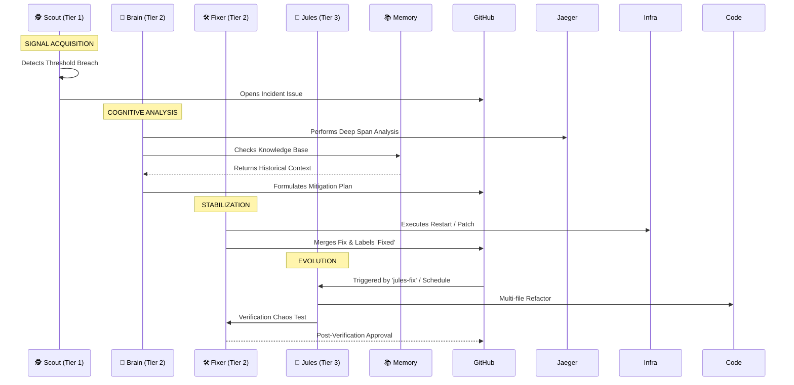

# 🤖 SRE-Space: Operational Intelligence Roster

This document formalizes the **Standard Operating Procedure (SOP)** for the SRE-Space autonomous agent cluster. It defines how telemetry flows from raw signals into architectural improvements.

---

## ⚡ The Incident Lifecycle: Signal to Architecture

SRE-Space follows a disciplined escalation path. Every incident is a learning opportunity.

---

## 🟢 Runtime Operations Cluster (Tier 1 & 2)

These agents manage the pulse of the system. They are optimized for **speed** and **safety**.

| Agent | Persona | Mission | Core Stack |
| :--- | :--- | :--- | :--- |
| **🕵️ Scout** | The Watchdog | Real-time monitoring of CUJs and infrastructure health. | Kafka, Python, HealthChecks |
| **🧠 Brain** | The Strategist | Context-aware Root Cause Analysis (RCA). | GPT-4o, Jaeger, OpenTelemetry |
| **🛠️ Fixer** | The Mechanic | Controlled remediation and GitOps state management. | GitHub MCP, Docker, Git |
| **📚 Memory** | The Historian | Continuous knowledge indexing and context retrieval. | ChromaDB, Vector Embeddings |

### 1️⃣ Scout Agent — The Observer
*   **Operational Logic**: Monitors Kafka event streams for business SLIs (Quotes vs Purchases).
*   **Boundary**: Scout does not diagnose. It validates that a breach is "Real" and creates the shared workspace (GitHub Issue).

### 2️⃣ Brain Agent — The Analyst
*   **Operational Logic**: Consumes Scout's context. Performed "Deep Span Analysis" to isolate bottlenecks (e.g., Latency vs Saturation).
*   **Boundary**: Brain identifies *what* and *why*. It does not execute.

### 3️⃣ Fixer Agent — The Executor
*   **Operational Logic**: Applies Brain’s decisions using bounded actions (Restarts or PRs).
*   **Governance**: No change bypasses version control. Maintains strict branch hygiene (pruning all but the Top 5 fix branches).

---

## 🔴 Architectural Evolution Layer (Tier 3)

### 4️⃣ Google Jules — Senior SRE Architect
Jules represents the **Tier-3 escalation**, responsible for deep refactoring that addresses systemic risks rather than transient symptoms.

*   **Activation**: 
    - Explicit `jules-fix` label (Urgent Refactor).
    - Daily **05:00 AM** maintenance window (System Tuning).
*   **Strategic Objectives**:
    - **Resilience**: Implementing Circuit Breakers and Retry Backoffs.
    - **Optimization**: SQL/NoSQL query tuning and caching layers.
    - **Integrity**: **NEVER** removes `otel_setup.py` hooks. Telemetry is non-negotiable.

---

## 📊 Shared Knowledge Base (Memory Persistence)

SRE-Space turns operations into knowledge.
- **Ingestion**: Every Post-Mortem written by **Brain** is vectorized by **Memory**.
- **Retrieval**: When **Scout** opens a new issue, **Memory** automatically injects the top 2 similar past incidents as a comment to assist **Brain**.

**SRE-Space: Designing reliability, one autonomous decision at a time.** 🚀