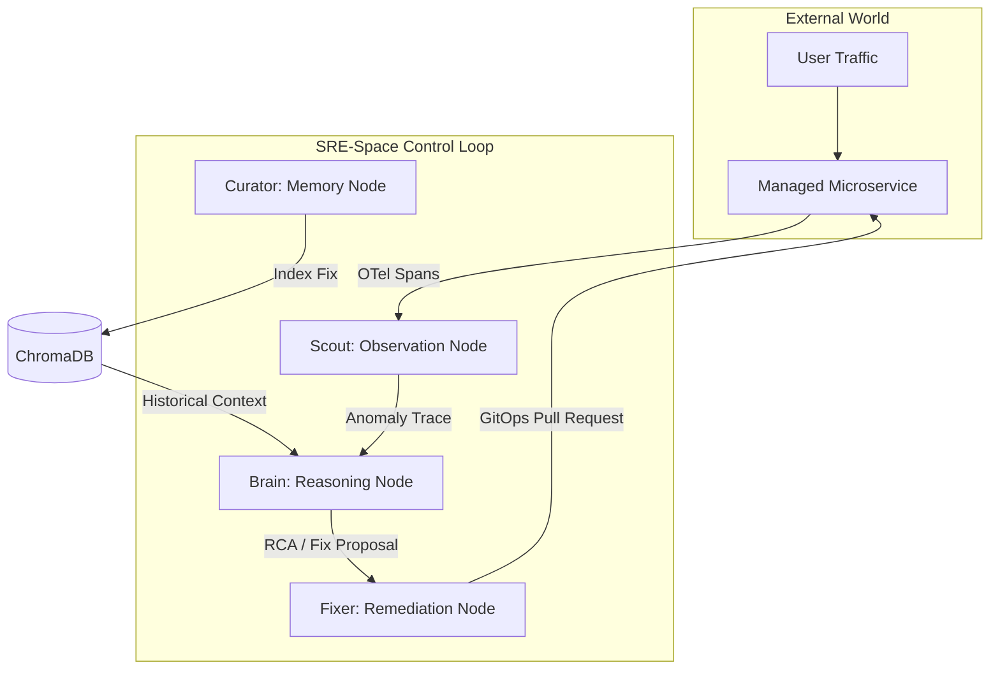

<div align="center">
  <h1>📡 SRE-Space</h1>
  <p><i><b>Autonomous Reliability Engineering for Distributed Systems</b></i></p>

  <p>
    <a href="https://sre-space-cp.vercel.app/apps/dashboard" target="_blank">
      
    </a>
    <a href="https://sre-space-cp.onrender.com/" target="_blank">
      
    </a>
  </p>

  <p>
    
    
    
    
  </p>
</div>

<br/>

## 📜 Executive Summary
**SRE-Space** is an autonomous SRE platform designed to close the gap between observability and remediation. It leverages a multi-agent **OODA loop** (Observe, Orient, Decide, Act) to detect, diagnose, and fix infrastructure failures in real-time. By transforming passive telemetry into active self-healing operations, SRE-Space ensures that distributed systems maintain high availability without manual intervention.

Unlike traditional monitors that merely alert humans, SRE-Space acts as a "Digital First Responder," capable of performing root-cause analysis (RCA) via generative AI and executing GitOps-based patches automatically.

---

## 🎯 Project Mission & Problem Statement
Infrastructure management in modern cloud-native environments has surpassed human cognitive limits. With microservices generating millions of spans and metrics per second, the time between an anomaly and a human-executed fix (MTTR) is often too high for mission-critical applications.

**SRE-Space solves this by:**
1.  **Eliminating Human Latency**: Agents operate at machine speed to triage and mitigate.
2.  **Cognitive Fault Diagnosis**: Moving beyond static thresholds to LLM-driven technical reasoning.
3.  **Veracity Tracking**: Ensuring every action is grounded in real system state, not just logs.

---

## 🏛️ System Architecture: The Control Loop

SRE-Space follows a strictly decoupled architecture, separating the **Mind** (Agent Logic), the **Eye** (Dashboard), and the **Senses** (Telemetry).

### 1. The Mind (Control Loop Engine)
Built with **FastAPI** and **LangGraph**, this is the central nervous system. It orchestrates the flow of data through various cognitive stages. It maintains a stateful view of the incident lifecycle, ensuring that multiple agents can collaborate on a single problem without stepping on each other.

### 2. The Eye (Orbital Dashboard)
A high-fidelity **Liquid Glass** interface built with Vanilla JS and CSS for maximum performance and low latency. It provides a real-time window into the agent's thoughts via Server-Sent Events (SSE).

### 3. The Senses (OpenTelemetry)
Standardized sensory intake using OTel. It captures spans and metrics from managed services (e.g., the Quote Service) and feeds them into the **Scout Agent** for anomaly detection.



---

## 🤖 Meet the Agent Squad

Each agent in SRE-Space is a specialized LLM-backed node running within a LangGraph state machine.

### 🔭 Scout (The Watcher)
-   **Role**: Continuous Observability.
-   **Logic**: High-frequency polling of OpenTelemetry collectors. It uses pattern matching to identify "Error Spans" vs. "Normal Noise."
-   **Output**: Structured Anomaly Traces.

### 🧠 Brain (The Architect)
-   **Role**: Root Cause Analysis & Decision Making.
-   **Logic**: Performs **RAG (Retrieval-Augmented Generation)** by querying ChromaDB for similar past incidents. If no match is found, it escalates to a Chain-of-Thought (CoT) reasoning phase using GPT-4o.
-   **Output**: Technical RCA and a machine-readable Remediation Plan.

### 🛠️ Fixer (The Engineer)
-   **Role**: Automated Action.
-   **Logic**: Executes the Remediation Plan via GitOps. It creates branches, modifies source code (e.g., increasing pool sizes), and submits Pull Requests.
-   **Output**: Validated GitOps PRs.

### 📂 Curator (The Librarian)
-   **Role**: Long-term Memory.
-   **Logic**: Summarizes the incident and the successful fix. It embeds this knowledge into the vector store.
-   **Output**: Persistent knowledge base updates.

---

## 🏆 Key Achievements (Technical Solves)

### 🔗 Monorepo Synchronization
The challenge of a dual-deployment (Render for Python/Backend and Vercel for JS/Frontend) was solved via a custom `vercel.json` routing layer. This layer proxies `/api/*` and `/system/*` requests to the distributed backend while serving the static dashboard with sub-millisecond latency.

### 🕵️ Veracity Engine
We replaced "static simulation" with a **Stateful Reality Manager** (`sim_state.py`). This ensures that if a failure is injected into a service, the agents see the exact same failure signature that a human operator would see in Jaeger or New Relic.

### 🌓 Dual-Mode Resource Scaling
One of the most complex features is the **Environment Switcher** (`config.py`).
-   **LOCAL**: Spins up Apache Kafka for high-throughput enterprise eventing.
-   **CLOUD**: Detects Render's resource constraints and switches to Managed Redis, reducing memory footprint by 60% without losing event integrity.

---

## 🛠️ Technology Stack Detail

### Backend (The Control Loop)
| Tech | Role |
| :--- | :--- |
| **FastAPI** | Async web engine for the agent loop and API endpoints. |
| **LangGraph** | Cycle-aware state machine for agent coordination. |
| **Uvicorn** | ASGI server for high-concurrency SSE streaming. |
| **Psutil** | Real-time system health and memory monitoring. |

### Cognitive / AI
| Tech | Role |
| :--- | :--- |
| **OpenAI GPT-4o** | Deep reasoning, RCA, and code generation. |
| **ChromaDB** | Vector store for incident pattern matching. |
| **Sentence-Transformers** | Local embedding generation for RAG. |

### Frontend (Orbital Control)
| Tech | Role |
| :--- | :--- |
| **Vanilla CSS** | Custom "Liquid Glass" theme with GPU-accelerated animations. |
| **EventSource API** | Real-time agent log streaming. |
| **TailwindCSS** | Layout utilities (used in specific UI modules). |

### Infrastructure
| Tech | Role |
| :--- | :--- |
| **Apache Kafka** | Distributed event bus (Local mode). |
| **Redis** | Lightweight event bus (Cloud mode). |
| **Docker** | Containerization for consistent multi-region deployment. |

---

## 📁 Monorepo Structure Deep-Dive

```text
SRE-Space-sre-space/
├── apps/
│   ├── control_plane/          # FastAPI Backend (The Mind)
│   │   ├── main.py             # Entry point & API routes
│   │   ├── langgraph_logic.py  # Agent workflow definition
│   │   └── config.py           # Multi-cloud env awareness
│   └── dashboard/              # The Dashboard (The Eye)
│       ├── index.html          # High-fidelity UI
│       ├── main.js             # SSE & Veracity logic
│       └── style.css           # Liquid Glass aesthetics
├── packages/
│   ├── agents/                 # Logic for individual cognitive nodes
│   │   ├── scout.py            # Telemetry observer
│   │   ├── brain.py            # RAG & RCA engine
│   │   └── fixer.py            # GitOps remediation logic
│   └── shared/                 # Core utilities
│       ├── sim_state.py        # Centralized system reality (Veracity)
│       └── github_service.py   # Secure GitHub API wrapper
├── infra/                      # Cloud configurations
│   └── otel-config.yaml        # OpenTelemetry routing
├── docker-compose.yml          # Enterprise Local Cluster
├── Dockerfile                  # Unified Backend Container
└── vercel.json                 # Monorepo Routing Policy
```

---

## 🚀 Execution Guide: Local & Cloud

### 📦 Local Setup (The "Unleashed" Experience)
The local stack runs the full 8-agent squad with dedicated Kafka and ChromaDB instances.

1.  **Clone & Configure**:
    ```bash
    git clone https://github.com/mohammedsalmanj/sre.space-cp.git
    cd sre.space-cp
    cp .env.example .env
    ```
2.  **Spin up Infrastructure**:
    ```bash
    docker-compose up -d
    ```
3.  **Monitor the Startup**:
    Watch the logs to see the agents initializing their connection to Kafka.
    ```bash
    docker-compose logs -f sre-engine
    ```

### ☁️ Cloud Deployment (The "Managed" Experience)
The platform is optimized for **Render** (Backend) and **Vercel** (Frontend).

1.  **Backend (Render)**:
    - Connect your repo to Render.
    - Select "Web Service."
    - Render will automatically use the `Dockerfile`.
    - Set `ENV=cloud` to trigger the Redis-based lean squad.
2.  **Frontend (Vercel)**:
    - Vercel automatically detects the `vercel.json`.
    - It builds the `apps/dashboard` and routes all API calls to your Render URL.

---

## 🧪 Chaos Engineering Lab
SRE-Space includes a "Synthetic Failure" module to test its own resilience.

-   **DB Pool Exhaustion**: Simulates a `Connection Refused` error. Scout will detect the 500 status code, and Brain will recommend a pool-size increase or a service restart.
-   **Latency Spike**: Simulates a `504 Gateway Timeout`. The agents will analyze the trace to see if the bottleneck is upstream (API) or downstream (Database).

**How to test:** 
1. Open the **Chaos Lab** in the dashboard.
2. Click **Inject Failure**.
3. Watch the **Real-Time Log Feed** to see the OODA loop in action.

---

## 🛡️ Security & Guardrails
Autonomous remediation requires strict safety policies. SRE-Space implements:

1.  **Memory Guard**: A middleware that monitors the Python process's RSS. If it exceeds `MEMORY_LIMIT_MB`, it gracefully stalls non-critical agents to prevent OOM.
2.  **GitOps Sandbox**: All fixes are committed to feature branches and subject to Pull Request reviews—never direct pushes to `main`.
3.  **Human-in-the-Loop (HITL)**: High-risk remediation actions are flagged for human sign-off via the "Escalation" log status.

---

## 🏁 Future Roadmap
- [ ] **Multi-Service Tracing**: Moving from single-service repair to cross-service distributed tracing RCA.
- [ ] **Predictive Scaling**: Using historical telemetry to predict failures before they happen (Proactive Mode).
- [ ] **Custom Agent Fine-Tuning**: Training smaller models purely on SRE manifests to reduce latency.

---

## ⚖️ License
Licensed under the **Apache License, Version 2.0**.
See [LICENSE](LICENSE) for the full text.

---

## 🤝 Contributing
We welcome contributions to the SRE-Space ecosystem. Whether you are improving agent logic or refining the observability bridge, please submit a PR against the `develop` branch.

---

**🌌 SRE-Space: Transforming Anomalies into Veracity and Veracity into Uptime.** 🚀

---

## 🔬 Extensive Technical Appendix

### The Event Bus Factory (`packages/shared/event_bus/factory.py`)
This module implements a Singleton Factory pattern to handle the environment-specific switching between Kafka and Redis. 

```python
def get_event_bus():
    if ENV == "cloud":
        return RedisEventBus(url=REDIS_URL)
    return KafkaEventBus(bootstrap_servers=KAFKA_BOOTSTRAP_SERVERS)
```
This ensures that the codebase remains agnostic to the messaging provider, allowing for 100% portable agent logic.

### RAG Logic in `brain.py`
The Brain agent uses a semantic search window of the last 100 incidents.
1.  **Query**: The current error span message.
2.  **Retrieval**: Fetches `n=1` results with `distance < 0.3`.
3.  **Reasoning**: If a match is found, the agent bypasses the expensive LLM call and uses the verified historical solution.

### Memory Guard Middleware
```python
@app.middleware("http")
async def memory_guard(request: Request, call_next):
    usage = psutil.Process().memory_info().rss / (1024 * 1024)
    if usage > MEMORY_LIMIT_MB:
         # Stall or reject non-critical sensory ingestion
         return JSONResponse(status_code=503, content={"error": "Resource Saturation"})
    return await call_next(request)
```
This is critical for running heavy LLM-driven agents on tiny cloud instances.

### Multi-Stage Docker Build
The Dockerfile uses a 2-stage build to reduce the final image size from 1.2GB to ~400MB.
1. **Stage 1**: Compile dependencies (C-extensions for ChromaDB).
2. **Stage 2**: Copy only the installed wheels and the application source to a clean `python:3.11-slim` image.

### Observability Pipeline
The `infra/otel-config.yaml` defines how traces are routed:
- **Receivers**: OTLP (gRPC/HTTP).
- **Processors**: Batching (for performance) and Memory Limiting.
- **Exporters**: Jaeger (local) and Logging (for debug veracity).

---

## 📖 Glossary
- **OODA**: Observe, Orient, Decide, Act.
- **MTTR**: Mean Time to Remediation.
- **GitOps**: Using Git as the single source of truth for infrastructure state.
- **Veracity**: The quality of being grounded in real-time truth.
- **Monorepo**: A single repository containing multiple related applications and packages.

---

*This document is maintained as the definitive technical standard for the SRE-Space platform.*
