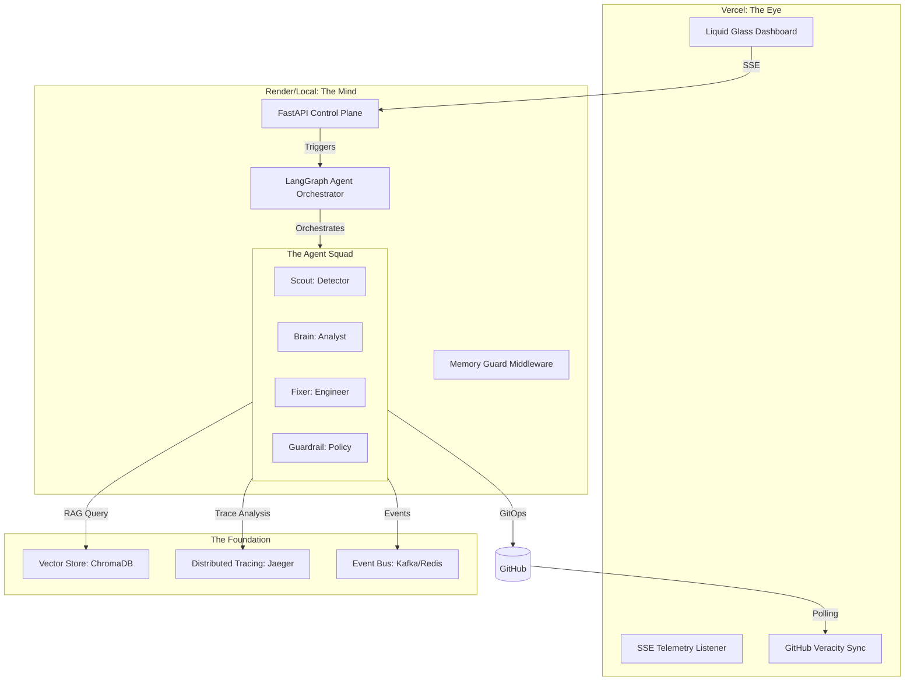

<div align="center">
  <h1>🌌 SRE-Space: Local-Power Control Plane v4.0</h1>
  <p><i>"Distributed SRE Monorepo with High-Performance Local Orchestration"</i></p>

  <p>
    
    
    
    
  </p>

  ---

  [](https://www.python.org/)
  [](https://langchain-ai.github.io/langgraph/)
  [](https://fastapi.tiangolo.com/)
  [](https://www.docker.com/)
  [](https://opentelemetry.io/)
  [](https://www.trychroma.com/)
  [](https://kafka.apache.org/)
  [](https://redis.io/)
  [](https://www.jaegertracing.io/)
  [](https://openai.com/)
</div>

<br/>

**SRE-Space** is a state-of-the-art, autonomous reliability platform. It moves beyond traditional monitoring by implementing a **Cognitive Control Plane** that don't just alert humans—it reasons, plans, and executes remediations independently. Built on a monorepo architecture, it synchronizes high-fidelity local orchestration with a global observability window.

---

## 🏛️ System Architecture

SRE-Space operates on a **Split-Brain Design**, separating the "Eye" (Observability) from the "Mind" (Execution).



---

## 💡 The Problem & The Cognitive Solution

### The Core Problem
Modern distributed systems generate overwhelming noise. When an incident occurs, a human SRE spends **70% of MTTR (Mean Time To Recovery)** just on "Orientation"—finding the right trace, checking recent PRs, and identifying the service owner.

### The Cognitive Solution: Autonomous OODA Loop
SRE-Space automates the **OODA Loop** (Observe, Orient, Decide, Act) using specialized AI agents:

1.  **Observe**: **Scout** identifies anomalies in [OpenTelemetry](https://opentelemetry.io/) spans or [Kafka](https://kafka.apache.org/) throughput lags.
2.  **Orient**: **Brain** correlates these spans with current system state, performs Root Cause Analysis (RCA), and queries **ChromaDB** for historical precedents.
3.  **Decide**: **Guardrail** validates the plan against security policies. **Human** intervention is requested only for high-risk path escalations.
4.  **Act**: **Fixer** executes the fix via GitOps (automated PRs) or direct Docker orchestration.

---

## 🚀 Key Features

- **Liquid Glass Observability**: A premium, real-time dashboard with grainy glassmorphism, delivering telemetric insights via Server-Sent Events (SSE).
- **Institutional Memory**: Every recovery cycle is indexed in a vector store. The system literally *learns* from its own failures.
- **Environment Awareness**: Seamlessly toggles between **Local-Power** (Full 8-agent squad, Kafka) and **Cloud-Optimized** (Core 5-agent squad, Redis, Memory Guard).
- **Veracity Verification**: Real-time cross-referencing between agent logs and GitHub PR statuses ensures the dashboard reflects reality, not just intent.

---

## 🛠️ Technical deep-dive

### Agent Squad Configuration
| Agent | Role | Capability |
| :--- | :--- | :--- |
| **🕵️ Scout** | Detector | Monitors OTel thresholds & Kafka lag. Signals the loop start. |
| **🧠 Brain** | Analyst | Performs deep trace diagnosis and RAG-based RCA generation. |
| **🛠️ Fixer** | Engineer | Writes code patches, manages branches, and handles PR lifecycle. |
| **🛡️ Guardrail**| Policy | Ensures remediations stay within defined safe boundaries. |
| **🤖 Jules** | Architect | Handles deep structural refactoring for Tier-3 escalations. |

### Data Flow & Persistence
- **Traces**: Captured via OTLP and visualized in [Jaeger](https://www.jaegertracing.io/).
- **Memory**: [ChromaDB](https://www.trychroma.com/) stores Post-Mortems as dense vectors, enabling sub-second similarity searches for new incidents.
- **Communication**: [FastAPI](https://fastapi.tiangolo.com/) serves as the bridge, with persistent SSE connections for real-time frontend updates.

---

## 🏁 Setup & Deployment

### Local "Unleashed" Mode (Recommended for Demo)
Requires Docker Desktop. This mode enables the full architectural suite.
```bash
# 1. Spin up the infrastructure
docker-compose up -d

# 2. Add Keys to .env
# GITHUB_PERSONAL_ACCESS_TOKEN and OPENAI_API_KEY are required
cp .env.example .env

# 3. Launch the Mind
pip install -r requirements.txt
python apps/control_plane/main.py
```

### Cloud "Optimized" Mode
Designed for 512MB RAM constraints (Render/Vercel).
- Uses **Redis** for lightweight messaging.
- Activates **Memory Guard** middleware to prevent OOM kills.
- Scaling: Limits to 2 parallel LLM reasoning threads.

---

## 📅 Future Roadmap
- [ ] **Multi-Repo Sensory Intake**: Expanding visibility across multiple monorepo neighbors.
- [ ] **Grafana Integration**: Exporting agent-reasoning-metrics to standard Grafana dashboards.
- [ ] **Self-Benchmark**: Automatic generation of "Resilience Score" based on successful autonomous recoveries.

**Build for 100% Uptime. Operated by Intelligence.** 🚀
