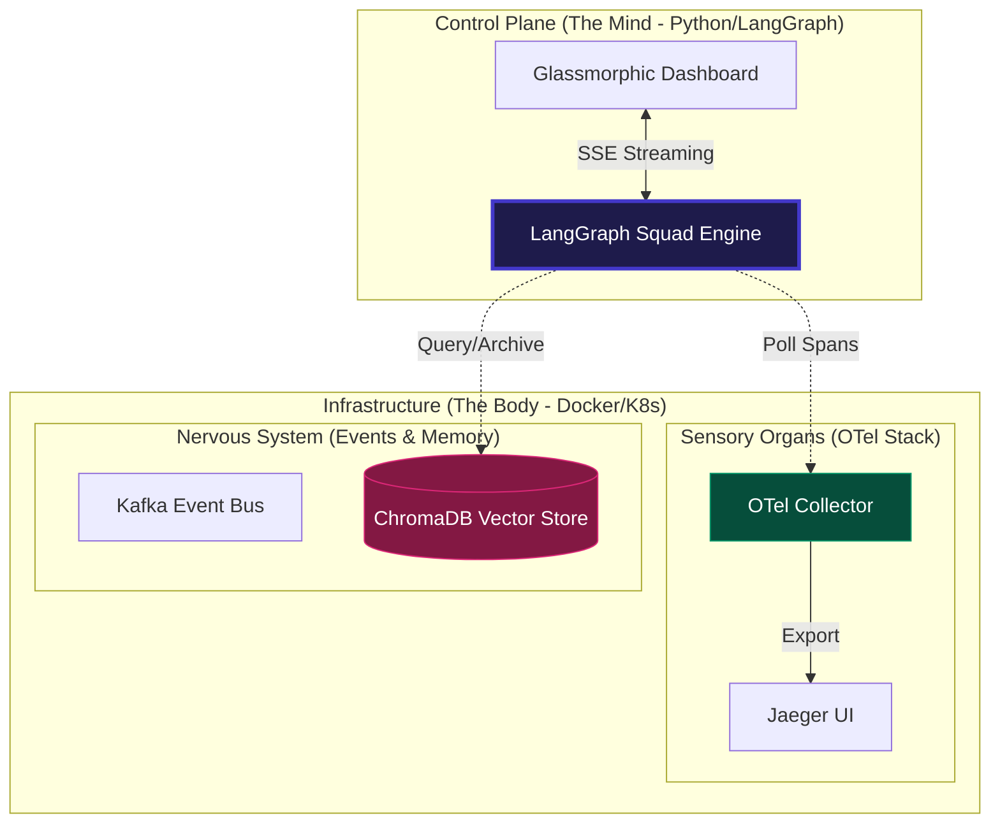
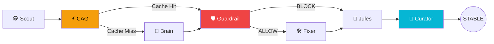
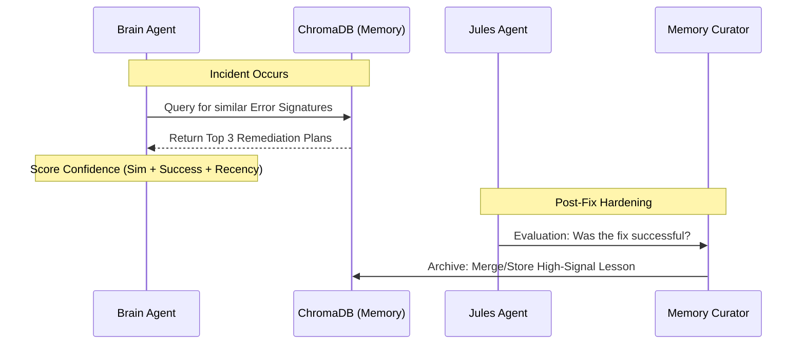
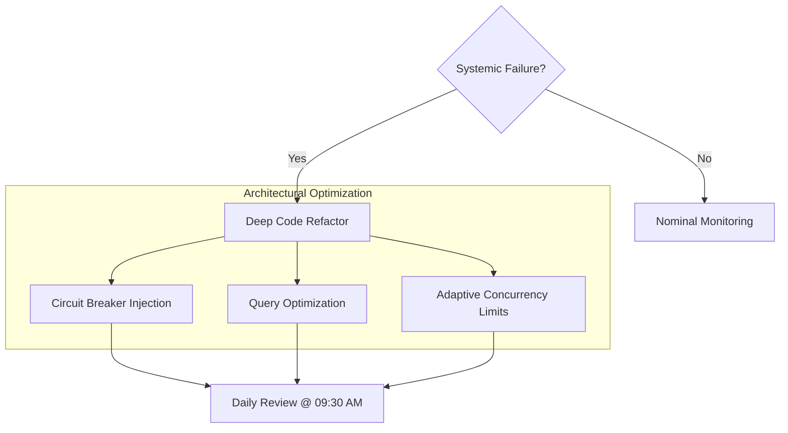

# 🌌 SRE-Space: The Cognitive Reliability Engine v3.0

[](https://www.python.org/)
[](https://langchain-ai.github.io/langgraph/)
[](https://openai.com/)
[](https://www.trychroma.com/)
[](https://opentelemetry.io/)
[](https://vercel.com/)

**SRE-Space** is an autonomous, self-healing **Cognitive Control Plane** designed for high-availability microservice ecosystems. It moves beyond simple alerts by orchestrating a modular squad of AI agents that detect anomalies, reason through root causes, enforce safety guardrails, and architecturally harden the system—all without human intervention.

---

## 🏛️ Diagram 1: System Topology (Mind & Body)

SRE-Space is architected as a **Hybrid Control Plane**. The **Body** handles sensory data and persistence, while the **Mind** executes the agentic reasoning loop.



---

## 🤖 Diagram 2: The 7-Agent Squad Workflow

We have modularized our intelligence into a **Directed Acyclic Graph (DAG)** of specialized agents. Each node handles a specific stage of the incident lifecycle.



---

## 🧠 Diagram 3: Agentic RAG & Memory Curation

SRE-Space implements a **Tiered Memory Layer** to ensure the system never fixes the same bug twice. We use semantic similarity to bridge the gap between "Raw Logs" and "Actionable Knowledge."



---

## 🏛️ Diagram 4: Jules Tier-3 Architectural Authority

**Jules** operates as the "Senior Architect" of the squad. While other agents fight fires, Jules eliminates the arsonist by redesigning the system architecture.



---

## 🤖 The Squad: Technical Authority Matrix

| Agent | Icon | Module | Mission | Authority |
| :--- | :---: | :--- | :--- | :--- |
| **Scout** | 🕵️ | `scout.py` | Detection | Monitors OTel spans for failures/latency. |
| **CAG** | ⚡ | `cag.py` | Latency | Tier-1 Flash Cache for FAQ-style incidents. |
| **Brain** | 🧠 | `brain.py` | Diagnosis | RCA using OpenAI GPT-4o-mini & ChromaDB. |
| **Guardrail**| 🛡️ | `guardrail.py` | Safety | Enforces policy & confidence scores > 0.75. |
| **Fixer** | 🛠️ | `fixer.py` | Recovery | Executes code patches and resource scaling. |
| **Jules** | 🤖 | `jules.py` | Hardening | Tier-3 authority for deep system refactors. |
| **Curator** | 🧹 | `curator.py` | Memory | Cleans and tags Knowledge into Vector store. |

---

## ⚡ Technical Stack & Tooling

*   **Logic Engine**: LangGraph (Stateful, Multi-Agent Orchestration).
*   **LLM Power**: OpenAI GPT-4o-mini (Reasoning & Refactoring).
*   **Observability**: OpenTelemetry (OTLP) + Jaeger (Distributed Tracing).
*   **Vector Database**: ChromaDB (Incident Signature Memory).
*   **Nervous System**: Kafka (Real-time Event Streaming).
*   **Web Framework**: FastAPI (Asynchronous logic with SSE streaming).

---

## 🚀 Getting Started

### 1. Prerequisite: The Body (Docker)
Initialize the infrastructure that provides the sensors and memory:
```bash
docker-compose up -d
```

### 2. Prerequisite: The Mind (Python)
Install the logic dependencies and start the Control Plane:
```bash
pip install -r requirements.txt
uvicorn main:app --reload --port 8000
```

### 3. Verification: The Chaos Lab
Click **"Inject Chaos"** on the [Dashboard](http://localhost:8000). Monitor the **7-Agent Console** to see the system traverse from detection via Scout to long-term memory archiving via Curator.

---

## ☁️ Deployment
The Control Plane is continuously deployed via Vercel.
**Live Hub**: [https://sre-space-cp.vercel.app/](https://sre-space-cp.vercel.app/)

---

> "Monitoring tells you that you have a problem. SRE-Space makes sure you don't have it again." 🌌
