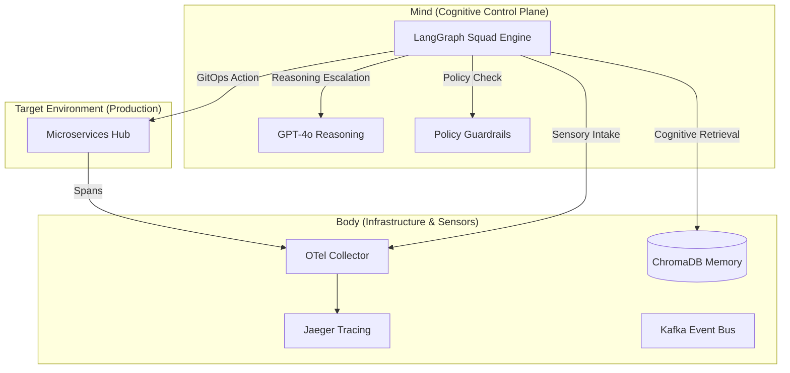

<div align="center">
  <h1>🌌 SRE-Space: Local-Power Control Plane v4.0</h1>
  <p><i>"Distributed SRE Monorepo with High-Performance Local Orchestration"</i></p>

  [](https://www.python.org/)
  [](https://langchain-ai.github.io/langgraph/)
  [](https://www.docker.com/)
</div>

---

## 🏛️ Local-Power Architecture
**SRE-Space** has transitioned to a local-first, high-performance architecture. While the sensor and brain core run on local Docker infrastructure to bypass cloud resource limits (e.g., 512MB RAM constraints), the **Dashboard** remains optimized for Vercel deployment, providing a global window into local SRE operations.

This setup enables:
- **Unrestricted Agent Reasoning**: Multi-agent loops run at full speed with 2GB+ memory.
- **Enterprise Event Bus**: Full Kafka + Zookeeper stack for high-throughput sensory intake.
- **Persistent Memory**: Local ChromaDB server for deep architectural history.
**SRE-Space** is not just a monitoring tool; it's an autonomous **Cognitive Control Plane**. It replaces traditional "alert-and-wait" workflows with a high-fidelity **Agentic Repair Loop**. 

Powered by **LangGraph**, it orchestrates a specialized squad of agents that simulate human SRE reasoning—detecting anomalies via OpenTelemetry, diagnosing root causes using RAG (Retrieval-Augmented Generation), and executing remediations through GitOps and Docker automation.

---

## 🏛️ System Architecture
The platform is a split-brain architecture where sensory input (Body) feeds agentic intelligence (Mind).



---

## 🤖 The 8-Agent High-Availability Squad

We have modularized intelligence into specialized roles, each with a specific technical authority:

| Agent | Module | Mission | Authority |
| :--- | :--- | :--- | :--- |
| **🕵️ Scout** | `packages/agents/scout.py` | Detection | Polls OTel traces for latency spikes and 5xx errors. |
| **⚡ CAG** | `packages/agents/cag.py` | Tier-1 Fix | Checks "Fast Cache" for instant FAQ-style remediations. |
| **🧠 Brain** | `packages/agents/brain.py` | RCA | Deep reasoning via RAG + OpenAI for complex failures. |
| **🛡️ Guardrail**| `packages/agents/guardrail.py`| Safety | Blocks non-compliant or low-confidence actions. |
| **🛠️ Fixer** | `packages/agents/fixer.py` | Execution | Standardized GitOps commits & Docker patch deployment. |
| **🤖 Jules** | `packages/agents/jules.py` | Hardening | Tier-3 Arch Authority for code-level design refactors. |
| **🧹 Curator** | `packages/agents/curator.py` | Memory | Tags and compresses postmortems into ChromaDB. |
| **🚨 Human** | `packages/agents/human.py` | HITL | Triggers email alerts if an issue repeats > 3 times. |

---

## 🛡️ Guardrails & Safety
Autonomous systems require trust. SRE-Space implements three layers of protection:
1. **Mathematical Confidence:** Agents must exceed a 0.85 confidence score to act.
2. **Policy Guardrail:** Validates that the remediation doesn't violate cluster constraints.
3. **Human-in-the-Loop (HITL):** If a loop is detected or an issue persists, the system halts and notifies **mohammedsalmanj@outlook.com**.

---

## 🛠️ Tech Stack
- **AI Orchestration:** LangGraph (Stateful Multi-Agent).
- **Core LLM:** OpenAI GPT-4o-mini.
- **Observability:** OpenTelemetry (OTLP) + Jaeger.
- **Event Bus:** Apache Kafka (Kraft Mode).
- **Vector Database:** ChromaDB.
- **Web Layer:** FastAPI (Async logic with Real-time SSE).

---

## 🏛️ Monorepo Architecture
SRE-Space is organized as a unified monorepo for maximum traceability and component reuse.

- **`apps/`**: Deployable services.
  - `control-plane/`: The LangGraph squad engine and core API.
  - `dashboard/`: Frontend visualization for SRE operations.
  - `websocket-bridge/`: Real-time telemetry stream handler.
- **`packages/`**: Shared logic and libraries.
  - `agents/`: The 8-agent squad logic.
  - `shared/`: Common GitOps and connectivity utilities.
- **`infra/`**: Infrastructure-as-Code (Docker Compose, OTel configuration).
- **`scripts/`**: Automation, verification, and chaos testing utilities.

---

## ⚡ Getting Started (Pro Mode)

### 1. Launch Infrastructure
Start the sensors, event bus, and memory:
```bash
docker-compose up -d
```

### 2. Start the Control Plane
```bash
pip install -r requirements.txt
python apps/control-plane/main.py
```

### 3. Verify & Try Chaos
Confirm the stack is healthy and trigger a self-healing loop:
```bash
python scripts/verify_sre_stack.py
python scripts/verify_loop.py
```

---

## 📊 Live Verification
Run the verification suite to confirm all connections (Chroma, OpenAI, GitHub) are green:
```bash
python scripts/verify_sre_stack.py
```

---
<div align="center">
  <p><i>"Monitoring tells you that you have a problem. SRE-Space makes sure you don't have it again."</i></p>
  <b>🌌 Built for the Future of Autonomous Operations</b>
</div>
