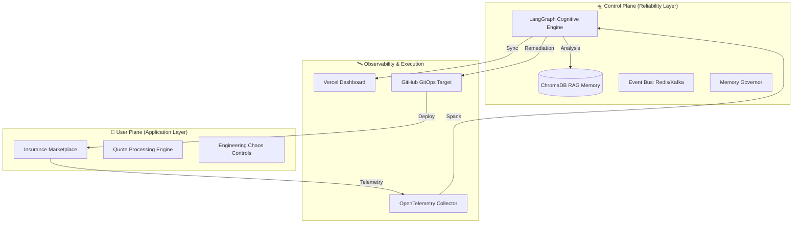
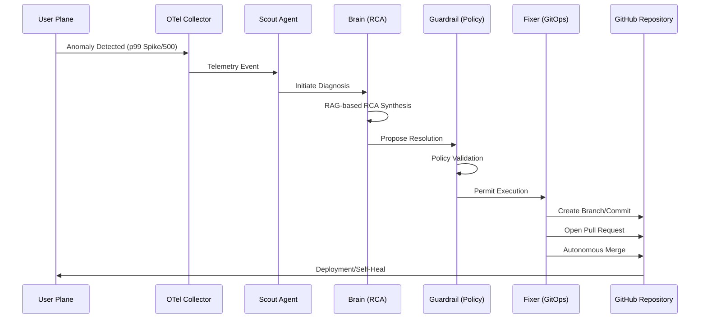

# SRE-Space
## Self-Healing Control Plane for Modern Cloud Infrastructure

SRE-Space is an autonomous control plane designed to detect, diagnose, and remediate production failures using multi-agent reasoning and GitOps execution.

**Tech Stack:** Render • Vercel • LangGraph • OpenAI • ChromaDB • Redis • Kafka • OpenTelemetry • FastAPI • Docker • GitHub • GitOps

---

## 1. The Core Problem

Modern distributed systems operate at a complexity level that exceeds manual operational capacity. Infrastructure management currently suffers from:

*   **Alert Fatigue:** High-velocity telemetry streams generate noise that overwhelms human operators.
*   **Manual Root Cause Analysis:** Correlation of metrics, traces, and logs is often performed ad-hoc, leading to diagnostic delays.
*   **Slow Incident Response:** The Mean Time To Repair (MTTR) is gated by human availability and manual intervention.
*   **Infrastructure Coupling:** Reliability logic is often embedded within the application, creating brittle dependencies.
*   **Human Bottlenecks:** Remediation requires manual code changes, PR approvals, and deployment triggers.
*   **Lack of Closed-Loop Reliability:** Most systems observe but do not act.

**The Central Question:** How do we transition from reactive, alert-driven operations to proactive, autonomous remediation?

---

## 2. Architectural Model — User vs Control Plane

SRE-Space enforces a strict separation between the **User Plane** (where business logic executes) and the **Control Plane** (where reliability intelligence resides).



### Separation of Concerns
*   **User Plane:** Hosts the Insurance Marketplace, processing transactions and emitting telemetry. It includes Engineering Controls to facilitate controlled fault injection.
*   **Control Plane:** Operates the 8-agent cognitive squad. It observes the User Plane independently, making autonomous decisions based on telemetry, historical context, and policy constraints.

---

## 3. Autonomous GitOps Reliability Model

Remediation in SRE-Space is not limited to "restarting services." It performs **source-level remediation** via a strict GitOps lifecycle.



---

## 4. The 8-Agent Cognitive Architecture

The engine orchestrates specialized agents to manage the OODA (Observe, Orient, Decide, Act) loop.

| Agent | Mission | Trigger | Authority | Output |
| :--- | :--- | :--- | :--- | :--- |
| **Scout** | Anomaly Detection | OTel Spans | Read-only Telemetry | [OBSERVE] Signal |
| **CAG** | Fast Cache Tier-1 | Scout Signal | Pattern Match | [ORIENT] Instant Fix |
| **Brain** | Tier-2 RCA | CAG Miss | Neural Reasoning | [ORIENT] RCA Synthesis |
| **Guardrail** | Safety Policy | Fixer Proposal | Veto Power | [DECIDE] ALLOW/DENY |
| **Fixer** | Implementation | Guardrail Approval| GitHub Write | [ACT] PR/Merge |
| **Curator** | Memory Management | Post-mortem | Vector Write | ChromaDB Update |
| **Jules** | Arch Hardening | Cron/Interval | System Audit | Design Proposal |
| **Human** | Escalation | Loop Threshold | Final Arbiter | Manual Intervention |

---

## 5. Runtime Profiles

The system maintains functional parity across hardware profiles via adaptive runtime configuration.

### Local Profile (Performance Mode)
*   **Event Bus:** Apache Kafka for high-throughput stream processing.
*   **Observability:** 100% trace sampling.
*   **Concurrency:** Uncapped LLM execution for high-frequency stress testing.
*   **Objective:** Validation of autonomous logic under extreme chaos.

### Cloud Profile (Adaptive Mode — Render)
*   **Event Bus:** Managed Redis for distributed signaling.
*   **Memory Guard:** Active `psutil` governor to survive within a 512MB RAM constraint.
*   **Concurrency:** Throttled execution to prevent resource exhaustion.
*   **Observability:** Selective sampling and optimized SSE streams.

---

## 6. Multi-Cloud Deployment Topology

SRE-Space is deployed across distinct providers to ensure the Control Plane remains isolated from User Plane failures.

*   **Render:** Hosts the Core Control Plane, the User Plane application, and the Redis event bus.
*   **Vercel:** Hosts the Observability Dashboard (Orbital Monitor), ensuring visibility even if the primary cloud hub is degraded.
*   **GitHub:** The authoritative target for all GitOps operations.

**Data Flow:**
1. User interacts with Render (App).
2. Render emits telemetry to the internal Scout.
3. Render (Fixer) communicates with GitHub API to push code fixes.
4. Render (Engine) streams real-time agent thoughts to Vercel via SSE.
5. Vercel polls GitHub API to sync PR status in the dashboard.

---

## 7. End-to-End Operational Flow

1.  **Request Initiation:** A user requests a policy quote in the Insurance Marketplace.
2.  **Anomaly Injection:** A fault is triggered (e.g., a "Dependency Timeout" via Engineering Controls).
3.  **Autonomous Detection:** Scout identifies a p99 latency breach.
4.  **Signal Broadcast:** An AnomalyEvent is published to the internal bus.
5.  **RCA Synthesis:** Brain performs a RAG-based analysis of the failure signature.
6.  **Policy Validation:** Guardrail verifies the fix plan against system safety thresholds.
7.  **GitOps Execution:** Fixer provisions a new branch and commits the remediation manifest.
8.  **Pull Request Lifecycle:** An autonomous PR is opened and immediately merged.
9.  **Verification:** The system monitors telemetry to ensure health has returned to NOMINAL.
10. **Memory Commitment:** Curator stores the incident post-mortem in the vector database for future caching.

---

## 8. Observability & Monitoring

The system utilizes 100% real-world telemetry; no mocks are used in the monitoring pipeline.
*   **OpenTelemetry:** Distributed tracing across service boundaries.
*   **SSE Log Streaming:** Sub-second delivery of agent cognitive traces to the monitor.
*   **Vercel Dashboard:** Professional-grade UI for real-time situational awareness.
*   **GitOps Tracking:** Live sync of GitHub PR and Issue status.

---

## 9. Reliability Safeguards

*   **Memory Guard:** Automatically enters Degraded Mode if RAM usage exceeds 450MB, throttling non-essential agent tasks.
*   **Circuit Breaker:** Disconnects failing upstream dependencies to prevent cascading failures.
*   **Confidence Threshold:** The system requires a >0.90 confidence score from the Brain before the Guardrail permits an autonomous fix.
*   **Human Escalation:** Triggers if three remediation attempts fail or if confidence remains below the threshold.

---

## 10. Deployment

### Render (Control Plane + User Plane)
Deployed using the repository's `render.yaml` blueprint. Requires `GITHUB_PERSONAL_ACCESS_TOKEN` and `OPENAI_API_KEY`. The platform automatically provisions the web service and the Redis instance.

### Vercel (Monitor)
The `monitor.html` is hosted as a standalone observability frontend. It establishes a secure "Satellite Link" to the Render backend to ingest SSE telemetry.

---

## 11. Local Development

Initialize the high-performance stack for local validation:

```bash
# 1. Start full stack with Kafka and full OTel sampling
docker-compose -f docker-compose.local.yml up --build

# 2. Inject a failure via the API
curl -X POST "http://localhost:8001/demo/inject-failure?type=500"

# 3. Observe the full GitOps repair loop in logs or at http://localhost:8001
```

---

## 12. Tech Stack Summary

| Layer | Technology |
| :--- | :--- |
| **Control Plane** | LangGraph (Stateful Agent Orchestration) |
| **API Framework** | FastAPI |
| **Event Bus** | Apache Kafka / Redis |
| **Vector Memory** | ChromaDB |
| **Intelligence** | OpenAI (GPT-4o) |
| **Observability** | OpenTelemetry |
| **User Plane** | Render |
| **Monitor UI** | Vercel |
| **GitOps Target** | GitHub |
| **Containerization** | Docker |

---

## 13. Closing Statement

SRE-Space demonstrates the transition from reactive, alert-driven operations to autonomous control planes that enforce reliability through code-level remediation. By combining cognitive reasoning with strict GitOps execution, the system establishes a new standard for self-healing infrastructure.

---
<div align="center">
  <b>Designed for Zero-Downtime. Driven by Intelligence.</b>
</div>
