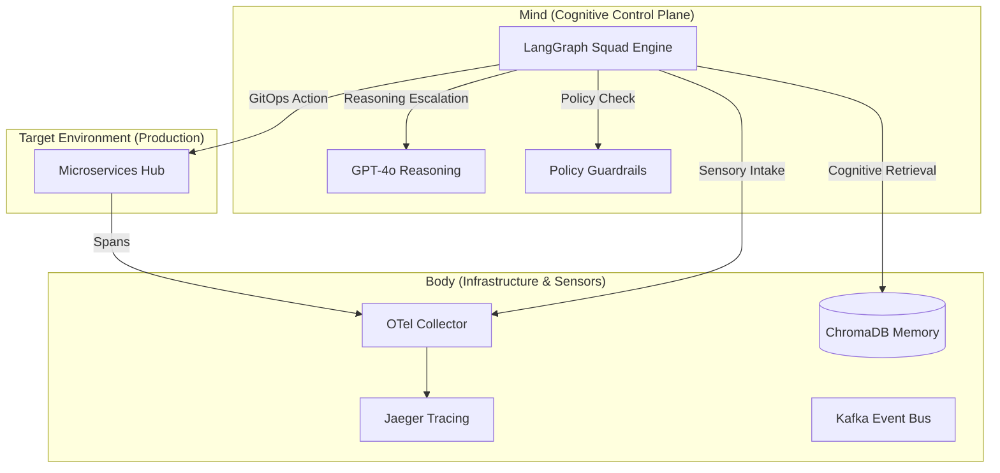

<div align="center">
  <h1>🌌 SRE-Space: The Cognitive Reliability Engine v3.5</h1>
  <p><i>"Self-Healing Infrastructure through Multi-Agent Cognitive Cycles"</i></p>

  [](https://www.python.org/)
  [](https://langchain-ai.github.io/langgraph/)
  [](https://openai.com/)
  [](https://www.trychroma.com/)
  [](https://opentelemetry.io/)
</div>

---

## 🚀 The Vision
**SRE-Space** is not just a monitoring tool; it's an autonomous **Cognitive Control Plane**. It replaces traditional "alert-and-wait" workflows with a high-fidelity **Agentic Repair Loop**. 

Powered by **LangGraph**, it orchestrates a specialized squad of agents that simulate human SRE reasoning—detecting anomalies via OpenTelemetry, diagnosing root causes using RAG (Retrieval-Augmented Generation), and executing remediations through GitOps and Docker automation.

---

## 🏛️ System Architecture
The platform is a split-brain architecture where sensory input (Body) feeds agentic intelligence (Mind).



---

## 🤖 The 8-Agent High-Availability Squad

We have modularized intelligence into specialized roles, each with a specific technical authority:

| Agent | Module | Mission | Authority |
| :--- | :--- | :--- | :--- |
| **🕵️ Scout** | `packages/agents/scout.py` | Detection | Polls OTel traces for latency spikes and 5xx errors. |
| **⚡ CAG** | `packages/agents/cag.py` | Tier-1 Fix | Checks "Fast Cache" for instant FAQ-style remediations. |
| **🧠 Brain** | `packages/agents/brain.py` | RCA | Deep reasoning via RAG + OpenAI for complex failures. |
| **🛡️ Guardrail**| `packages/agents/guardrail.py`| Safety | Blocks non-compliant or low-confidence actions. |
| **🛠️ Fixer** | `packages/agents/fixer.py` | Execution | Standardized GitOps commits & Docker patch deployment. |
| **🤖 Jules** | `packages/agents/jules.py` | Hardening | Tier-3 Arch Authority for code-level design refactors. |
| **🧹 Curator** | `packages/agents/curator.py` | Memory | Tags and compresses postmortems into ChromaDB. |
| **🚨 Human** | `packages/agents/human.py` | HITL | Triggers email alerts if an issue repeats > 3 times. |

---

## 🛡️ Guardrails & Safety
Autonomous systems require trust. SRE-Space implements three layers of protection:
1. **Mathematical Confidence:** Agents must exceed a 0.85 confidence score to act.
2. **Policy Guardrail:** Validates that the remediation doesn't violate cluster constraints.
3. **Human-in-the-Loop (HITL):** If a loop is detected or an issue persists, the system halts and notifies **mohammedsalmanj@outlook.com**.

---

## 🛠️ Tech Stack
- **AI Orchestration:** LangGraph (Stateful Multi-Agent).
- **Core LLM:** OpenAI GPT-4o-mini.
- **Observability:** OpenTelemetry (OTLP) + Jaeger.
- **Event Bus:** Apache Kafka (Kraft Mode) / Redis.
- **Vector Database:** ChromaDB.
- **Web Layer:** FastAPI (Async logic with Real-time SSE).

---

## 🚀 Deployment Instructions

### Local Environment
Run the full-fidelity cluster with Kafka, Jaeger, and high-concurrency agents:
```bash
docker-compose -f docker-compose.local.yml up --build
```

### Cloud Environment (Render Blueprint)
Deploy via `render.yaml` using Render Blueprint:
1. Fork this repository.
2. Link your account to Render.com.
3. Select **New** -> **Blueprint**.
4. Provide the following environment variables:
   - `OPENAI_API_KEY`
   - `GITHUB_PERSONAL_ACCESS_TOKEN`

---

## 🏥 System Health & Runtime Intelligence
- **Health Check**: `GET /system/health` - Real-time metrics on memory usage, degraded mode status, and event bus backend.
- **Memory Guard**: The engine automatically enters `DEGRADED_MODE` if memory usage exceeds 450MB to maintain stability in constrained environments.
- **Ready Probe**: `GET /ready` - Confirms connectivity to event bus and agent registration.

---

## 🏛️ Monorepo Architecture
- **`apps/`**
  - `control_plane/`: Core LangGraph engine and API.
  - `websocket_bridge/`: Unified event streamer.
- **`packages/shared/`**
  - `event_bus/`: Abstraction layer for Kafka/Redis implementations.
  - `memory_guard/`: Runtime RAM monitoring and protection logic.

---

## 🏥 Architecture Legacy
- **`agents/`**: The 8-agent squad logic (Scout, CAG, Brain, Guardrail, Fixer, Curator, Human, Jules).
- **`shared/`**: Common GitOps, GitHub, and reporting utilities.
- **`infra/`**: Infrastructure-as-Code (OTel configuration).
- **`scripts/`**: Automation, verification, and chaos testing utilities.

---

<div align="center">
  <p><i>"Monitoring tells you that you have a problem. SRE-Space makes sure you don't have it again."</i></p>
  <b>🌌 Built for the Future of Autonomous Operations</b>
</div>
