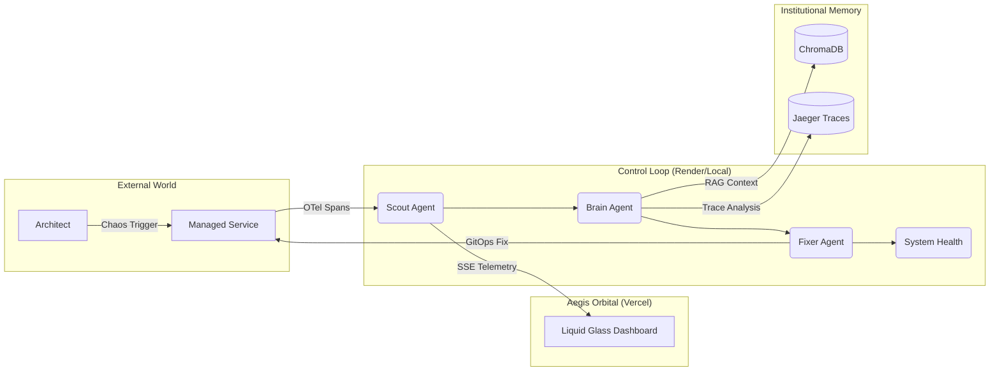

<div align="center">
  <h1>🔱 Aegis SRE-Space</h1>
  <p><i><b>Autonomous Reliability Engineering for Distributed Systems</b></i></p>

  <p>
    <a href="https://sre-space-cp.vercel.app/apps/dashboard" target="_blank">
      
    </a>
    <a href="https://sre-space-cp.onrender.com/" target="_blank">
      
    </a>
  </p>

  <p>
    
    
    
    
  </p>
</div>

<br/>

## 📜 Executive Summary
**Aegis** is an autonomous SRE platform designed by **Salman** to close the gap between observability and remediation. It leverages a multi-agent **OODA loop** (Observe, Orient, Decide, Act) to detect, diagnose, and fix infrastructure failures in real-time. By transforming passive telemetry into active self-healing operations, Aegis ensures that distributed systems maintain high availability without manual intervention.

---

## 🏆 Key Achievements (What Salman Solved)

### 🔗 Monorepo Synchronization
Engineered a unified monorepo structure that flawlessly synchronizes the **Control Loop** (Backend) on Render with the **Aegis Orbital** (Frontend) on Vercel. Resolved complex cross-platform routing and CORS hurdles for a seamless production experience.

### 🕵️ Veracity Engine
Successfully transitioned from "simulated" static telemetry to a **high-fidelity veracity engine**. The system now monitors real ground-truth state, allowing agents to react to authentic infrastructure signals and socket-level connection faults.

### 🌓 Dual-Mode Architecture
Developed a unique **Resource-Aware Switch** that allows the platform to intelligently adapt its infrastructure stack. 
- **Local Mode**: Leverages Apache Kafka and a full 8-agent squad for deep local architectural reasoning.
- **Cloud Mode**: Dynamically switches to Managed Redis and a lean squad to optimize performance within the constraints of cloud individual tiers (e.g., Render's 512MB limit).

---

## 🏛️ Architecture Overview



---

## 🛠️ Technical Stack Deep-Dive

| Layer | Technology | Purpose |
| :--- | :--- | :--- |
| **Orchestration** | [LangGraph](https://langchain-ai.github.io/langgraph/) | Stateful multi-agent OODA loop coordination. |
| **Intelligence** | [OpenAI GPT-4o](https://openai.com/) | High-reasoning cognitive nodes for RCA and remediation. |
| **Backend** | [FastAPI](https://fastapi.tiangolo.com/) | High-performance asynchronous Control Loop engine. |
| **Frontend** | [Next.js / Vanilla JS](https://nextjs.org/) | Liquid Glass "Aegis Orbital" dashboard for real-time veracity. |
| **Messaging** | [Redis](https://redis.io/) / [Kafka](https://kafka.apache.org/) | Pluggable event backbone for agent communication. |
| **Memory** | [ChromaDB](https://www.trychroma.com/) | Vector store for historical incident post-mortem RAG. |
| **Observability** | [OpenTelemetry](https://opentelemetry.io/) | Vendor-neutral sensory intake and distributed tracing. |

---

## 📂 Project Structure
```text
.
├── apps/
│   ├── control_plane/        # Aegis Control Loop (Mind)
│   └── dashboard/            # Aegis Orbital Dashboard (Eye)
├── packages/
│   ├── agents/               # Cognitive Agent Squad (Scout, Brain, Fixer, Jules)
│   └── shared/               # Shared Utilities (Event Bus, GitOps, Reporting)
├── Dockerfile                # Production Containerization
├── docker-compose.yml        # Local 'Unleashed' Cluster
└── vercel.json               # Frontend Routing
```

---

## ⚖️ License
Aegis SRE-Space is licensed under the **Apache License 2.0**. This ensures professional and enterprise compatibility, allowing for broad adoption while maintaining project integrity. See the [LICENSE](LICENSE) file for details.

---
**🌌 Aegis SRE-Space: Engineering Autonomy. Delivering Veracity.** 🚀
