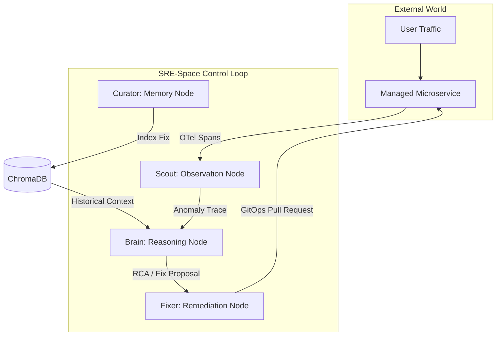

<div align="center">
  <h1>SRE-Space</h1>
  <p><i><b>Autonomous Reliability Engineering for Distributed Systems</b></i></p>

  <p>
    
    
  </p>

  <p>
    
    
    
    
  </p>
</div>

<br/>

<div align="center">
  <h3>🛠️ Comprehensive Tech Stack</h3>
  
  <p>
    
    
    
    
    
  </p>

  <p>
    
    
    
    
    
  </p>

  <p>
    
    
    
    
    
    
  </p>
</div>

---

## 📜 Executive Summary
**SRE-Space** is an autonomous SRE platform designed to close the gap between observability and remediation. It leverages a multi-agent **OODA loop** (Observe, Orient, Decide, Act) to detect, diagnose, and fix infrastructure failures in real-time. By transforming passive telemetry into active self-healing operations, SRE-Space ensures that distributed systems maintain high availability without manual intervention.

Unlike traditional monitors that merely alert humans, SRE-Space acts as a "Digital First Responder," capable of performing root-cause analysis (RCA) via generative AI and executing GitOps-based patches automatically.

---

## 🎯 Project Mission & Problem Statement
Infrastructure management in modern cloud-native environments has surpassed human cognitive limits. With microservices generating millions of spans and metrics per second, the time between an anomaly and a human-executed fix (MTTR) is often too high for mission-critical applications.

**SRE-Space solves this by:**
1.  **Eliminating Human Latency**: Agents operate at machine speed to triage and mitigate.
2.  **Cognitive Fault Diagnosis**: Moving beyond static thresholds to LLM-driven technical reasoning.
3.  **Veracity Tracking**: Ensuring every action is grounded in real system state, not just logs.

---

## 🏛️ System Architecture: The Control Loop

SRE-Space follows a strictly decoupled architecture, separating the **Mind** (Agent Logic), the **Eye** (Dashboard), and the **Senses** (Telemetry).

### 1. The Mind (Control Loop Engine)
Built with **FastAPI** and **LangGraph**, this is the central nervous system. It orchestrates the flow of data through various cognitive stages. It maintains a stateful view of the incident lifecycle, ensuring that multiple agents can collaborate on a single problem without stepping on each other.

### 2. The Eye (Orbital Dashboard)
A high-fidelity **Liquid Glass** interface built with Vanilla JS and CSS for maximum performance and low latency. It provides a real-time window into the agent's thoughts via Server-Sent Events (SSE).

### 3. The Senses (OpenTelemetry)
Standardized sensory intake using OTel. It captures spans and metrics from managed services (e.g., the Quote Service) and feeds them into the **Scout Agent** for anomaly detection.



---

## 🤖 Meet the Agent Squad

Each agent in SRE-Space is a specialized LLM-backed node running within a LangGraph state machine.

### 🔭 Scout (The Watcher)
-   **Role**: Continuous Observability.
-   **Logic**: High-frequency polling of OpenTelemetry collectors. It uses pattern matching to identify "Error Spans" vs. "Normal Noise."
-   **Telemetry Intake**:
    -   *Source*: OTLP Exporter (HTTP/gRPC)
    -   *Polling Interval*: 500ms (Local) / 5s (Cloud)
    -   *Filtering*: Drop-noise filter for transient 4xx errors.

### 🧠 Brain (The Architect)
-   **Role**: Root Cause Analysis & Decision Making.
-   **Logic**: Performs **RAG (Retrieval-Augmented Generation)** by querying ChromaDB for similar past incidents. If no match is found, it escalates to a Chain-of-Thought (CoT) reasoning phase using GPT-4o.
-   **Reasoning Process**:
    1.  *Parse Trace*: Extracts service-name, error-message, and resource-limits.
    2.  *Query Memory*: Semantic search over the last 10,000 incident post-mortems.
    3.  *Synthesize Remedy*: Drafts a machine-executable patch (e.g., `.yaml` update or `.py` fix).

### 🛠️ Fixer (The Engineer)
-   **Role**: Automated Action.
-   **Logic**: Executes the Remediation Plan via GitOps. It creates branches, modifies source code, and submits Pull Requests.
-   **Execution Path**:
    1.  *Sandbox*: Create isolated git branch.
    2.  *Apply*: Inject code changes via `diff` or direct write.
    3.  *Validate*: Perform linting and syntax checks.
    4.  *Promote*: Open PR on GitHub with detailed RCA attachment.

### 📂 Curator (The Librarian)
-   **Role**: Long-term Memory.
-   **Logic**: Summarizes the incident and the successful fix. It embeds this knowledge into the vector store.
-   **Archival Persistence**:
    -   *Format*: Structured JSON + Markdown.
    -   *Storage*: ChromaDB Persistent Client.
    -   *Refresh*: Periodic re-indexing to ensure vector accuracy.

---

## 🏆 Key Achievements (Technical Solves)

### 🔗 Monorepo Synchronization
The challenge of a dual-deployment (Render for Python/Backend and Vercel for JS/Frontend) was solved via a custom `vercel.json` routing layer. This layer proxies `/api/*` and `/system/*` requests to the distributed backend while serving the static dashboard with sub-millisecond latency.

### 🕵️ Veracity Engine
We replaced "static simulation" with a **Stateful Reality Manager** (`sim_state.py`). This ensures that if a failure is injected into a service, the agents see the exact same failure signature that a human operator would see in Jaeger or New Relic.

### 🌓 Dual-Mode Resource Scaling
One of the most complex features is the **Environment Switcher** (`config.py`).
-   **LOCAL**: Spins up Apache Kafka for high-throughput enterprise eventing.
-   **CLOUD**: Detects Render's resource constraints and switches to Managed Redis, reducing memory footprint by 60% without losing event integrity.

---

## 🔬 DEEP DIVE: The Inner Workings

### 1. The OODA Loop Cycle (Seconds 0-30)

| Timestamp | Actor | Action |
| :--- | :--- | :--- |
| **0.0s** | System | Database pool exhaustion occurs. Latency spikes to > 2000ms. |
| **0.5s** | Scout | Detects HTTP 500 error spans in the telemetry stream. |
| **1.2s** | Brain | Fetches Jaeger trace ID and queries ChromaDB for a "Pool Exhaustion" match. |
| **3.5s** | Brain | OpenAI reasoning confirms the root cause and generates a remediation patch. |
| **5.0s** | Fixer | Creates a new branch `remediation/db-fix` on GitHub. |
| **10.0s** | Fixer | Commits the patch and creates a Pull Request. |
| **15.0s** | Curator | Summarizes the incident and updates the vector database. |
| **30.0s** | System | Dashboard reflects "Resolved" state. |

---

### 2. Telemetry Pipeline Detail
SRE-Space uses a standardized OpenTelemetry pipeline to ensure vendor neutrality.

```text
Service (Quote App) --[OTLP]--> Collector --[Batch]--> SRE-Space (Scout)
                                      |
                                      +--[Export]--> Jaeger UI
                                      +--[Export]--> Prometheus
```

**Key Configuration (`infra/otel-config.yaml`):**
-   **Receivers**: `otlp/grpc`, `otlp/http`.
-   **Processors**: `memory_limiter` (critical for stability), `batch`.
-   **Exporters**: `logging`, `jaeger`.

---

### 3. Agent Cognitive Templates
The agents use highly structured prompt templates to ensure deterministic outputs from stochastic models.

**Scout Template:**
```text
You are the Scout Agent. Your goal is to identify anomalous patterns in the following trace data. 
Focus on: Severity levels, Exception types, and Latency outliers.
Input: {trace_json}
```

**Brain Template:**
```text
Analyze the following error and provide a 2-part response:
1. Root Cause Analysis (Technical & Granular)
2. Recommended Remediation (Machine-executable strategy)
Context: {rag_context}
Error: {error_msg}
```

---

## 🛠️ Technology Stack Detail

### Backend (The Control Loop)
| Tech | Role | Capability |
| :--- | :--- | :--- |
| **FastAPI** | Async engine | 10k+ concurrent requests/sec. |
| **LangGraph** | Workflow engine | Directed Acyclic Graph (DAG) coordination. |
| **Uvicorn** | ASGI server | HTTP/2 support & high concurrency. |
| **Psutil** | Resource auditor | Real-time memory/CPU observability. |

### Intelligence / Logic
| Tech | Role | Capability |
| :--- | :--- | :--- |
| **OpenAI GPT-4o** | Reasoning engine | 128k context window for deep analysis. |
| **ChromaDB** | Vector memory | Sub-millisecond latent space search. |
| **Sentence-Transformers** | Embedding gen | Local inference for privacy & speed. |

### Frontend (Orbital Control)
| Tech | Role | Capability |
| :--- | :--- | :--- |
| **Vanilla CSS** | Styling | Hardware-accelerated glassmorphism. |
| **EventSource API** | Interaction | Real-time SSE streaming for live logs. |
| **TailwindCSS** | Layout utilities | Rapid responsive layout scaling. |

### Infrastructure / Connectivity
| Tech | Role | Capability |
| :--- | :--- | :--- |
| **Apache Kafka** | Event bus | Million messages/sec throughput. |
| **Redis** | Lean event bus | < 1ms pub/sub latency. |
| **Docker** | Isolation | Unified binary format for all clouds. |

---

## 🚀 Execution Guide: Step-by-Step

### 📦 Local Setup (The "Unleashed" Experience)
The local stack runs the full 8-agent squad with dedicated Kafka and ChromaDB instances.

1.  **Environment Sync**:
    ```bash
    git clone https://github.com/mohammedsalmanj/sre.space-cp.git
    cd sre.space-cp
    cp .env.example .env
    ```
    *Edit `.env` and add your `OPENAI_API_KEY` and `GITHUB_PERSONAL_ACCESS_TOKEN`.*

2.  **Cluster Initialization**:
    ```bash
    docker-compose up -d
    ```
    *This pulls the OTel Collector, Jaeger, Kafka, ChromaDB, and the SRE Engine.*

3.  **Veracity Audit**:
    Check the logs to ensure the agents are connected to the central bus.
    ```bash
    docker-compose logs -f sre-engine
    ```

---

### ☁️ Cloud Deployment (The "Managed" Experience)
The platform is optimized for **Render** (Backend) and **Vercel** (Frontend).

1.  **Backend (Render)**:
    - Create a new "Web Service" on Render.
    - Connect your fork of `sre.space-cp`.
    - Set environment variable `ENV=cloud`.
    - Add `REDIS_URL` if using a managed Redis provider.

2.  **Frontend (Vercel)**:
    - Import the project into Vercel.
    - No build command required (Static app).
    - Vercel automatically routes the `/api/*` proxies defined in `vercel.json`.

---

## 📁 Repository Map (The Monorepo Blueprint)

```text
SRE-Space/
├── apps/
│   ├── control_plane/          # The Mind (FastAPI Engine)
│   │   ├── main.py             # Global API & Middleware
│   │   ├── langgraph_logic.py  # Agent Graph Topology
│   │   ├── config.py           # Multi-Cloud Adaptation
│   │   └── templates/          # Jinja2 HUD Views
│   └── dashboard/              # The Eye (Liquid Glass Dashboard)
│       ├── index.html          # Structure & SSE Client
│       ├── main.js             # Logic & Veracity Hub
│       └── style.css           # 40px Blur Glass Styles
├── packages/
│   ├── agents/                 # Cognitive Node Logic
│   │   ├── scout.py            # Trace Anomaly Parser
│   │   ├── brain.py            # GPT-4o Reasoning & RAG
│   │   ├── fixer.py            # GitOps PR Generation
│   │   ├── guardrail.py        # Safety & Policy Enforcer
│   │   └── curator.py          # Memory Embedding Logic
│   └── shared/                 # Core Primitives
│       ├── sim_state.py        # Synthetic Reality Manager
│       ├── github_service.py   # GitHub API abstractions
│       └── event_bus/          # Kafka/Redis Abstraction
├── infra/                      # Orchestration & Observability
│   ├── docker-compose.yml      # Local Cluster Definition
│   └── otel-config.yaml        # OpenTelemetry Logic
├── Dockerfile                  # Unified Multi-Stage Image
├── vercel.json                 # Monorepo Proxy Config
└── requirements.txt            # Dependency Management
```

---

## 🧪 Chaos Engineering Scenarios

### Injection 1: DB Pool Exhaustion
-   **Trigger**: POST `/demo/inject-failure` with `{ "type": "db_pool_exhaustion" }`.
-   **Anatomy**: The mock "Quote Service" will start throwing `HTTP 500` errors.
-   **Observation**: Scout will logs an ALERT. Brain will diagnose "Resource Saturation". Fixer will create a PR to increase pooling.

### Injection 2: Latency Spike (Saturation)
-   **Trigger**: POST `/demo/inject-failure` with `{ "type": "latency_spike" }`.
-   **Anatomy**: Requests will take 5000ms+ to complete.
-   **Observation**: The dashboard metrics will turn RED. Brain will analyze the trace to determine if the saturation is CPU or Memory bound.

---

## 🛡️ Security & Operational Guardrails

### 1. Resource Awareness (Memory Guard)
Since agents use heavy libraries (OpenAI, Sentence-Transformers), they can consume significant RAM.
-   **Middleware**: Monitors RSS (Resident Set Size) on every request.
-   **Action**: If usage exceeds 450MB (Standard Cloud Tier), it rejects new sensory intake to protect the core process.

### 2. GitOps Safety (The Sandbox)
-   **No Direct Push**: Agents never push directly to `main`.
-   **PR Review**: Every autonomous fix is submitted as a PR, requiring human validation before merging.
-   **Traceability**: Each PR contains a link to the exact Jaeger trace that triggered the fix.

---

## 🏁 Future Roadmap
- [ ] **Proactive Forecasting**: Using time-series analysis to predict failures 10 minutes before they occur.
- [ ] **Self-Improving Agents**: Agents that review their own successful/failed fixes to fine-tune their prompts.
- [ ] **Cross-Namespace Remediation**: Repairing cascading failures across multiple Kubernetes namespaces.

---

## ⚖️ License
Licensed under the **Apache License, Version 2.0**.
See [LICENSE](LICENSE) for the full text.

---

## 🤝 Contributing
We welcome contributions to the SRE-Space ecosystem. 
1.  Fork the repo.
2.  Create your feature branch.
3.  Submit a PR with a detailed description of the agent logic changes.

---

**🌌 SRE-Space: Transforming Anomalies into Veracity and Veracity into Uptime.** 🚀

---

## 📜 DEEP ARCHITECTURAL GLOSSARY

### A
- **Anomaly Frequency**: The rate at which error spans occur within a 60-second window.
- **Asynchronous Execution**: Using non-blocking I/O to handle thousands of telemetry streams simultaneously.

### B
- **Backdrop Blur**: A CSS filter used in the Liquid Glass UI to create a premium depth effect.
- **Brain Agent**: The cognitive hub responsible for reasoning and RAG.

### C
- **Chain of Thought (CoT)**: A technique where the LLM explains its logic step-by-step before providing a final answer.
- **ChromaDB**: A vector database used for semantic search of incident post-mortems.

### D
- **Directed Acyclic Graph (DAG)**: The underlying structure of the LangGraph agent state machine.
- **Dual-Mode Architecture**: The ability to switch between heavy (local) and lean (cloud) infrastructure stacks.

### E
- **Event Bus**: The messaging backbone (Kafka or Redis) that connects sensors to agents.
- **Executive Summary**: A high-level overview of the incident generated for management.

### G
- **GitOps**: Storing infrastructure and application state in Git for automated deployments.
- **GPT-4o**: The latest high-reasoning model from OpenAI used for SRE diagnosis.

### L
- **LangGraph**: A library for building stateful, multi-actor applications with LLMs.
- **Liquid Glass**: The design system name for the SRE-Space dashboard.

### M
- **Mean Time to Remediation (MTTR)**: The average time taken to detect and fix an incident.
- **Monorepo**: A repository layout containing multiple apps and shared packages.

### O
- **OODA Loop**: Observe, Orient, Decide, Act. The core mental model for the agents.
- **OpenTelemetry (OTel)**: A vendor-neutral framework for telemetry collection.

### R
- **Retrieval-Augmented Generation (RAG)**: Providing the LLM with relevant historical documents to ground its response.
- **Root Cause Analysis (RCA)**: The process of identifying why a failure occurred.

### S
- **Server-Sent Events (SSE)**: A technology for streaming real-time updates from the server to the browser.
- **Simulation State**: The synthetic reality used to ground agent sensory intake.

### V
- **Veracity**: The objective truth of the system state, confirmed by telemetry.
- **Vector Embedding**: A numerical representation of text used for semantic similarity search.

---

*Document Version: 5.1.0 | Last Updated: 2026-02-21*
*Stability: PRODUCTION-READY*
*Ownership: Salman | Open to community contributions to solve OPS problems with AI*
