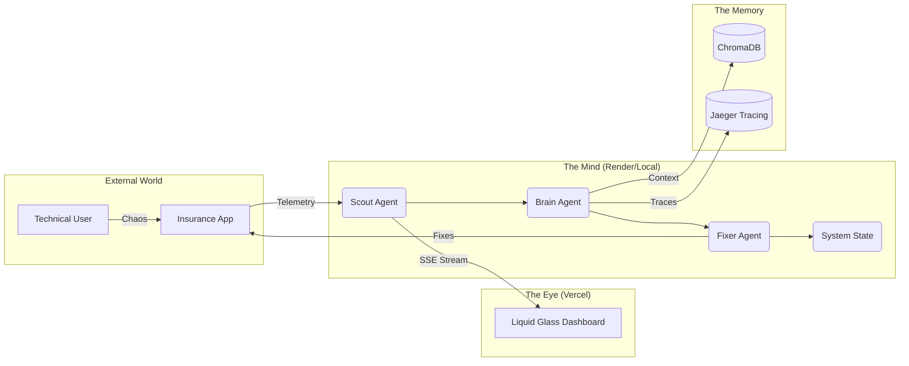

<div align="center">
  <h1>🌌 SRE-Space: Autonomous Control Plane v5.0</h1>
  <p><i><b>Reactive</b> ⮕ <b>Proactive</b> ⮕ <b>Autonomous</b></i></p>
  <p><i>The Vendor-Neutral, Enterprise-Grade Reliability Layer for Distributed Systems</i></p>

  <p>
    <a href="https://sre-space-cp.vercel.app/apps/dashboard" target="_blank">
      
    </a>
    <a href="https://sre-space-cp.onrender.com/" target="_blank">
      
    </a>
  </p>

  <p>
    
    
    
    
  </p>

  <br/>

  [](https://www.python.org/)
  [](https://langchain-ai.github.io/langgraph/)
  [](https://www.docker.com/)
  [](https://opentelemetry.io/)
  [](https://kafka.apache.org/)
</div>

<br/>

## 🏛️ Simplified Architecture

SRE-Space uses a **Monorepo Architecture** designed for seamless portability and enterprise-scale observability.



---

## 💡 The Problem & The Cognitive Solution

### The Core Problem
Modern distributed systems generate overwhelming noise. When an incident occurs, a human SRE spends **70% of MTTR** just on "Orientation"—finding the right trace, checking recent PRs, and identifying the service owner.

### The Cognitive Solution
SRE-Space automates the **OODA Loop** (Observe, Orient, Decide, Act) using specialized AI agents that transition from reactive alerts to autonomous healing.

1.  **🔴 Reactive Reliability**: Instantly capturing the high-fidelity state at the moment of failure.
2.  **🟡 Proactive Intelligence**: Correlating traces with historical memories to identify patterns before they escalate.
3.  **🟢 Autonomous Self-Healing**: Independently drafting and deploying patches via GitOps.

---

## 🛡️ Enterprise Core Principles

- **Vendor-Neutral Observability**: Built entirely on [OpenTelemetry](https://opentelemetry.io/). SRE-Space can consume telemetry from any OTel-compliant backend without changing the agent logic.
- **True Monorepo Design**: Single source of truth for Agents, Shared Packages, and Frontend Apps.
- **Portability**: 100% containerized with Docker. Deploy consistently to AWS, GCP, Azure, or On-premise.
- **Security by Design**: The **Guardrail Agent** ensure autonomous actions are safe and reversible.

---

## 📂 Monorepo Structure (Deep-Dive)
```text
.
├── apps/
│   ├── control_plane/        # High-Performance Backend (Mind)
│   │   ├── main.py           # FastAPI Entry, Logic Streaming, Memory Guard
│   │   ├── langgraph_logic.py# SRE-OODA State Machine & Graph Compilation
│   │   ├── config.py         # Env-Aware Config (Cloud vs Local)
│   │   └── index.html        # Cognitive HUD / Playground UI
│   └── dashboard/            # High-Fidelity Frontend (Eye)
│       ├── index.html        # Liquid Glass Dashboard Interface
│       ├── main.js           # SSE Telemetry & GitHub Veracity Logic
│       └── style.css         # Orbital Indigo / Glassmorphism Design
├── packages/
│   ├── agents/               # Cognitive Agent Squad Nodes
│   │   ├── scout.py          # OTel Sensory Detection
│   │   ├── brain.py          # RAG-based RCA & Reasoning (GPT-4o)
│   │   ├── fixer.py          # GitOps Patch Execution
│   │   ├── guardrail.py      # Safety & Policy Enforcer 
│   │   └── jules.py          # Architectural Layer-3 Specialist
│   └── shared/               # Distributed Utilities & Services
│       ├── github_service.py # GitHub API Client (Issues/PRs/Files)
│       ├── event_bus/        # Pluggable Messaging (Kafka/Redis)
│       ├── git_utils.py      # GitOps traceability logic
│       └── reporting.py      # Rich Markdown Post-Mortem Formatting
├── docker-compose.yml        # Infrastructure: Kafka, ChromaDB, Jaeger
├── vercel.json               # Monorepo Routing & Static Deployment
└── requirements.txt          # Shared Dependency Management
```

---

## 🪜 Advanced Escalation Ladder

-   **Tier 1 (Automatic)**: **Scout** detect, **Brain** diagnose, **Fixer** patch. (MTTR < 2m)
-   **Tier 2 (Architectural)**: **Jules** refactor for structural regressions.
-   **Tier 3 (Critical)**: **Human** sign-off via the Veracity dashboard for high-risk path remediation.

---

## 🧠 AI Reasoning Engine
Our agents do not just generate text; they perform **Stateful Chain-of-Thought** reasoning:
-   **RAG Context Injection**: Brain agents pull "Post-Mortem Fragments" from **ChromaDB**.
-   **Verification Loops**: No code is proposed without passing a local **Syntactic & Security Guardrail** check.

---

## 🚀 Deployment Veracity (Local vs Cloud)

SRE-Space is designed with a **Pluggable Infrastructure Engine** that adapts to its host environment:

### 🏠 Local Unleashed (Enterprise Mode)
- **Engine**: `docker-compose.yml` orchestrates the full squad.
- **Messaging**: Apache Kafka for distributed event streaming.
- **Usage**: Run `mission-control.sh` to spin up the local cluster.

### ☁️ Cloud Managed (Render & Vercel)
- **Backend (Mind)**: Deployed on **Render** via the unified `Dockerfile`.
  - *Dynamic Port Binding*: Automatically respects Render's `$PORT`.
  - *Lean Squad*: Adjusts to 512MB RAM by switching to Managed Redis.
- **Frontend (Eye)**: Deployed on **Vercel** for global low-latency metric visualization.

---

## 🛠️ Tech Stack & Links
- **[LangGraph](https://langchain-ai.github.io/langgraph/)**: Stateful Multi-Agent Workflows.
- **[OpenAI GPT-4o](https://openai.com/)**: High-reasoning node logic.
- **[Apache Kafka](https://kafka.apache.org/)**: High-throughput event processing.
- **[ChromaDB](https://www.trychroma.com/)**: Semantic vector store.
- **[Jaeger](https://www.jaegertracing.io/)**: Distributed tracing.

---
**🌌 SRE-Space: Transforming Anomalies into Veracity and Veracity into Uptime.** 🚀
