# 🌌 SRE-Space: The Cognitive Reliability Engine v3.0

[](https://www.python.org/)
[](https://langchain-ai.github.io/langgraph/)
[](https://fastapi.tiangolo.com/)
[](https://www.docker.com/)
[](https://opentelemetry.io/)

**SRE-Space** is an autonomous "Immune System" for microservice architectures. It transforms monitoring from a human-reactive pager hell into a **Cognitive Control Plane** where AI agents detect, diagnose, and remediate incidents using real-time telemetry and Agentic RAG.

---

## 🏛️ System Architecture: The "True North"

Reliability is not a state; it's a process. SRE-Space splits the world into the **Mind** (Logic/Agents) and the **Body** (Infrastructure/Senses).

```mermaid
graph TD
    subgraph "Mind (Logic Layer & Control Plane)"
        Dashboard[SRE Dashboard UI]
        subgraph "LangGraph Agent Squad"
            Scout[🕵️ Scout Agent]
            Brain[🧠 Brain Agent]
            Fixer[🛠️ Fixer Agent]
            Jules[🤖 Jules Agent]
        end
    end

    subgraph "Body (Infrastructure Layer)"
        subgraph "Telemetry & Senses"
            Jaeger[Jaeger Trace UI]
            OTel[OTel Collector]
        end
        subgraph "Nervous System & Memory"
            Kafka[Kafka Event Bus]
            Chroma[(ChromaDB Vector Memory)]
        end
    end

    %% Interactions
    Dashboard -->|SSE Stream| Scout
    Scout -->|Detects Error| Brain
    Brain -->|RCA & Knowledge LookUp| Fixer
    Fixer -->|Applies Fix| Jules
    Jules -->|Harden & Archive| Chroma

    %% Data Connections
    Scout -.->|Check Spans| OTel
    Brain -.->|Retrieve History| Chroma
    OTel -.->|Export| Jaeger
    
    %% Styling
    style Dashboard fill:#1e1b4b,stroke:#4338ca,color:#fff,stroke-width:2px
    style Scout fill:#064e3b,stroke:#059669,color:#fff
    style Brain fill:#4c1d95,stroke:#7c3aed,color:#fff
    style Fixer fill:#78350f,stroke:#d97706,color:#fff
    style Jules fill:#1e3a8a,stroke:#2563eb,color:#fff
    style Chroma fill:#831843,stroke:#db2777,color:#fff
    style Jaeger fill:#0f172a,stroke:#334155,color:#fff
```



---

## 🤖 The Agent Squad (LangGraph Nodes)

| Agent | Module | Mission | Technical Action |
| :--- | :--- | :--- | :--- |
| **Scout** | `🕵️ Watchdog` | Detection | Polls OTel spans for 5XX errors or latency > 800ms via Jaeger API. |
| **Brain** | `🧠 Strategist` | Diagnostics | Performs Root Cause Analysis (RCA) on stack traces and OTel metadata. |
| **Fixer** | `🛠️ Mechanic` | Remediation | Executes code patches, pod restarts, or configuration updates. |
| **Jules** | `🤖 Architect` | Hardening | Implements Circuit Breakers & Retries; updates RAG vector memory. |

---

## 🏗️ The Hybrid Execution Model

Unlike simple CRUD apps, SRE-Space requires a **Body** and a **Mind** to function.

### 1. The Infrastructure Layer (The Body) 🐳
We use **Docker** to run the services that provide the agents with their "Senses":
*   **Jaeger / OTel**: Provides the deep-trace observability.
*   **Kafka**: The event bus for microservice communication.
*   **ChromaDB**: The long-term "Reliability Memory" using RAG.

### 2. The Logic Layer (The Mind) 🐍
The **FastAPI + LangGraph** engine runs the high-level reasoning:
*   **Uvicorn** serves the glassmorphic Dashboard.
*   **LangGraph** manages the state transitions between agents.
*   **Server-Sent Events (SSE)** stream agent "thoughts" to the UI in real-time.

---

## 📚 Agentic RAG: "Zero-Repeat" Failure Strategy

SRE-Space uses **Retrieval-Augmented Generation** to ensure the system never fixes the same bug twice.

1.  **Ingestion**: Every successful remediation is cleaned, tokenized, and stored in **ChromaDB**.
2.  **Retrieval**: When a new incident occurs, the **Brain** queries the vector store for similar trace signatures.
3.  **Inference**: The agents use historical context to verify their current fix, drastically reducing MTTR (Mean Time To Recovery).

---

## 🚀 Deployment & Start-Up Guide

### Phase 1: Spin up the Infrastructure
Ensure Docker is running.
```bash
docker-compose up -d
```

### Phase 2: Start the Cognitive Engine
```bash
# Install dependencies
pip install -r requirements.txt

# Start the Control Plane
uvicorn main:app --reload --port 8000
```

### Phase 3: Access Control
*   **Dashboard**: [http://localhost:8000](http://localhost:8000)
*   **Jaeger Traces**: [http://localhost:16686](http://localhost:16686)
*   **Vector Engine**: [http://localhost:8000](http://localhost:8000) (internal endpoint)

---

## ⚡ Scalability Matrix

| Feature | Local Demo | Enterprise Stack |
| :--- | :--- | :--- |
| **Tracing** | Jaeger (Single Node) | Global OTel / Honeycomb / Datadog |
| **Events** | Kafka (Single Broker) | Managed Confluent Cluster |
| **Memory** | ChromaDB (Local) | Pinecone / Weaviate Cluster |
| **Agents** | Python (Uvicorn) | Kubernetes Control-Plane Pods |

---

## 🧪 Validating the Loop
1.  Open the **SRE Dashboard**.
2.  Click **"Inject Chaos"**.
3.  Observe the **Agent Console**:
    *   **Scout** detects the anomaly from OTel.
    *   **Brain** analyzes the trace via Jaeger.
    *   **Fixer** applies the remediation.
    *   **Jules** archives the lesson in RAG.

---

> "Monitoring is about knowing. SRE-Space is about solving." 🌌
