# 🌌 SRE-Space: The Cognitive Reliability Engine

   

**SRE-Space** is a self-evolving **AIOps Control Plane** that transforms traditional incident response into a cognitive, self-improving lifecycle. It goes beyond automation by integrating distributed tracing, vector memory, and architectural refactoring into a single cohesive system.

Instead of manual triage, SRE-Space deploys a coordinated squad of AI Agents that **Detect, Diagnose, Fix, and Learn**. It analyzes failure patterns across the stack and re-architects the microservices in real-time to prevent recurrence.

---

## ⚡ The Edge: From Monitoring to Cognition

| Feature | The Human Limit | The SRE-Space Advantage |
| :--- | :--- | :--- |
| **Response Time** | 15-30m (Paged) | **< 60s (Autonomous)** |
| **Root Cause** | Guesses or Wiki-Checks | **Deep Span Trace Analysis** |
| **Memory** | Subject to engineer churn | **Persistent Vector Knowledge Base** |
| **System Evolution** | Becomes "Legacy" Code | **Daily Architectural Refactoring** |

---

## 🏛️ System Architecture

The platform consists of a **Protected Microservices Layer** (the app) guarded by the **Cognitive Control Plane**.

```mermaid
graph TD
    subgraph "Protected Infrastructure"
        QS[Quote Service] -->|Events| Kafka
        PS[Policy Service] -->|Events| Kafka
        US[User Service] -->|Events| Kafka
        Frontend --> QS
        QS -->|Traces| Jaeger
        PS -->|Traces| Jaeger
    end

    subgraph "Cognitive Control Plane"
        Scout[🕵️ Scout Agent] -->|Monitors| Kafka
        Scout -->|Checks| Health[Health Checks]
        Scout -->|Creates| Issue[GitHub Incident]

        Brain[🧠 Brain Agent] -->|Analyzes| Issue
        Brain -->|Deep Span Analysis| Jaeger
        Brain -->|Instructs| Fixer

        Fixer[🛠️ Fixer Agent] -->|Executes| Cmd[Docker Restart]
        Fixer -->|GitOps| PR[Pull Request]
        
        Memory[📚 Memory Agent] -->|Indexes| ChromaDB[(Vector Knowledge Base)]
        Memory -->|Retrieves| Patterns[Historical Context]
    end

    subgraph "Strategic Escalation (Tier 3)"
        Jules[🤖 Google Jules] -->|Refactors| Code[Codebase]
        Jules -->|Architectural Fix| PR
    end

    Brain -.->|Writes PM| Issue
    Fixer -->|Auto-Merge| GitHub[GitHub Main]
    GitHub -->|Deploy| Infra[Deploy-Infra Action]
```



---

## 🤖 The Agent Squad

For the full detailed roster and SOPs, read **[AGENTS.md](./AGENTS.md)**.

### 🟢 Tactical Response (Real-Time)
*   **🕵️ Scout (The Watchdog)**: Correlates Business Yield (Conversion Rate) with Service Health. 
*   **🧠 Brain (The Strategist)**: Uses distributed traces (Jaeger) to perform "X-Ray" diagnostics.
*   **🛠️ Fixer (The Mechanic)**: Safely applies remediations via Docker or GitOps PRs.
*   **📚 Memory (The Historian)**: A RAG-enabled librarian that ensures the system never repeats a mistake.

### 🔴 Strategic Escalation (Architectural)
*   **🤖 Google Jules (The Architect)**: Performs deep refactoring to implement circuit breakers, caching, and query optimizations.

---

## 🔄 The Cognitive Loop (Workflow)

```mermaid
sequenceDiagram
    participant Sys as Infrastructure
    participant Scout as 🕵️ Scout
    participant Brain as 🧠 Brain
    participant Fixer as 🛠️ Fixer
    participant Jules as 🤖 Jules

    Sys->>Sys: 💥 Failure Detected
    Scout->>GitHub: 🚨 Opens Incident Issue
    Brain->>Jaeger: Queries Trace Spans
    Brain->>GitHub: Post RCA & Mitigation Plan
    Fixer->>Sys: 🚑 Executes Stabilization Fix
    alt Recurrence
        Brain->>GitHub: Escalates to 'jules-fix'
        Jules->>Code: 🏗️ Architectural Refactor
    end
```



---

## 🚀 Getting Started

### 1. Installation
```bash
# Clone the repository
git clone https://github.com/mohammedsalmanj/sre.space-cp.git
cd sre.space-cp

# Start the Cognitive Control Plane
docker-compose up -d --build
```

### 2. Live Consoles
| Console | URL | Description |
| :--- | :--- | :--- |
| **SRE Dashboard** | [http://localhost:3001](http://localhost:3001) | Real-time SLIs & AI Audit Log |
| **Jaeger Traces** | [http://localhost:16686](http://localhost:16686) | Deep Bottleneck Identification |
| **Knowledge Base** | [http://localhost:8000/docs](http://localhost:8000/docs) | Search the AI's "Memory" |
| **Cloud Dashboard** | [](https://vercel.com/new/clone?repository-url=https%3A%2F%2Fgithub.com%2Fmohammedsalmanj%2Fsre.space-cp&root-directory=apps/frontend) | One-Click Cloud Deployment |

---

## 🧪 Chaos Lab
Validate the AI's intelligence:
- `python trigger_chaos.py oom`: Test the **Fixer's** auto-healing.
- `python trigger_chaos.py saturation`: Test the **Brain's** diagnostics.
- `./mission-control.sh verify-jules-pr`: Test the **Architect's** verification loop.

---

## 🛡️ Core Ethics
*   **Observability First**: Decisions are driven by telemetry, not heuristics.
*   **Safe-Fail**: Every automated change is version-controlled and reversible.

**Designing a more resilient future.** 🌌

