# 🌌 SRE-Space: The Cognitive Reliability Engine v3.0

[](https://www.python.org/)
[](https://langchain-ai.github.io/langgraph/)
[](https://fastapi.tiangolo.com/)
[](https://www.docker.com/)
[](https://opentelemetry.io/)

**SRE-Space** is an autonomous "Immune System" for microservice architectures. It transforms monitoring from a human-reactive pager hell into a **Cognitive Control Plane** where AI agents detect, diagnose, remediate, and harden incidents using real-world telemetry and Agentic RAG.

---

## 🏛️ Comprehensive Architecture: The "Mind-Body" Duality

SRE-Space is built on the principle of **Separation of Concerns between Logic and Infrastructure**. We call this the **Mind-Body Duality**.

### 1. The Mind (Logic Layer & Control Plane) 🧠
The agents live here. This is a Python-native environment using **FastAPI** for the interface and **LangGraph** for orchestration.
- **Agent Orchestration**: LangGraph manages the state machine, ensuring agents take turns and share context.
- **Real-time Streaming**: Uses Server-Sent Events (SSE) to push agent "thoughts" to the Dashboard without the overhead of heavy WebSockets.

### 2. The Body (Infrastructure Layer & Senses) 🐳
The infrastructure provides the raw data (telemetry) and persistent memory.
- **Jaeger/OTel**: The "Eyes" of the system. Provides deep-trace observability into every microservice.
- **Kafka**: The "Nervous System." Moves signals and events across the platform.
- **ChromaDB**: The "Memory." A vector database where historical failures and their fixes are archived.

```mermaid
graph TD
    subgraph "Logic Layer (The Mind)"
        Dashboard[SRE Dashboard UI]
        subgraph "Autonomous Squad (LangGraph)"
            Scout[🕵️ Scout Agent]
            Brain[🧠 Brain Agent]
            Fixer[🛠️ Fixer Agent]
            Jules[🤖 Jules Agent]
        end
    end

    subgraph "Infrastructure Layer (The Body)"
        subgraph "Observability Backbone"
            Jaeger[Jaeger UI]
            OTel[OTel Collector]
        end
        subgraph "State & Memory"
            Kafka[Kafka Event Bus]
            Chroma[(ChromaDB Vector Memory)]
        end
    end

    %% Interactions
    Dashboard -->|User Request/Chaos| Scout
    Scout -->|Detection Signal| Brain
    Brain -->|Root Cause & RAG Search| Fixer
    Fixer -->|Auto-Remediation| Jules
    Jules -->|Optimization & Hardening| Chroma

    %% Data Connections
    Scout -.->|OTLP Span Polling| OTel
    Brain -.->|Vector Similarity Search| Chroma
    OTel -.->|Trace Export| Jaeger
    
    %% Styling
    style Dashboard fill:#1e1b4b,stroke:#4338ca,color:#fff,stroke-width:2px
    style Scout fill:#064e3b,stroke:#059669,color:#fff
    style Brain fill:#4c1d95,stroke:#7c3aed,color:#fff
    style Fixer fill:#78350f,stroke:#d97706,color:#fff
    style Jules fill:#1e3a8a,stroke:#2563eb,color:#fff
    style Chroma fill:#831843,stroke:#db2777,color:#fff
    style Jaeger fill:#0f172a,stroke:#334155,color:#fff
```



---

## 🤖 Deep Dive: The Agent Squad (LangGraph Nodes)

The core logic of SRE-Space is a sequence of **Thinking Steps**. Each agent is a specialized Python node.

| Agent | Module | Functional Logic | Technical Action |
| :--- | :--- | :--- | :--- |
| **Scout** | `🕵️ Watchdog` | Anomaly Detection | Scans `opentelemetry` spans for `status_code=INTERNAL_ERROR` or latency > 800ms. |
| **Brain** | `🧠 Strategist` | Diagnostics | Parses OTel attributes to find the specific microservice and `exception.message`. Queries RAG for history. |
| **Fixer** | `🛠️ Mechanic` | Remediation | Applies the remediation plan: e.g., scaling up a pod, patching a DB config, or restarting a hung service. |
| **Jules** | `🤖 Architect` | **Tier-3 Authority** | Architectural authority triggered for systemic failures. Performs deep code refactoing (Circuit Breakers, Query Opts) and runs daily reviews at 09:30 AM GMT+5:30. |

---

## 📚 Agentic RAG: How Memory is Handled

One of the most powerful features of SRE-Space is its **Agentic Memory**. It ensures the system never fixes the same bug twice.

1.  **Incident Archive**: Every time the **Fixer** successfully resolves an issue, it creates a "Knowledge Tuple" containing the trace signature and the fix.
2.  **Semantic Embedding**: This tuple is converted into a vector and stored in **ChromaDB**.
3.  **Real-time Retrieval**: When a new incident occurs, the **Brain Agent** grabs the current error string and asks ChromaDB: *"Give me the Top 3 incidents that look like this."*
4.  **Zero-Guessing**: Instead of "hallucinating" a fix, the agent applies the **Highest-Confidence Historical Remediation**.

---

## ⚡ Scalability Matrix: From Lab to Production

SRE-Space is designed to be lean for local development but robust for enterprise deployment.

| Feature | Local (Single-Node) | Enterprise (Distributed) |
| :--- | :--- | :--- |
| **Orchestration** | Python / Uvicorn | Kubernetes Control-Plane Pods |
| **Tracing** | Jaeger (All-in-One) | Distributed Tempo / Honeycomb / Datadog |
| **Telemetry** | OTel Collector (Container) | OTel Collector (DaemonSets) |
| **Events** | Kafka (Single Broker) | Managed Confluent Cluster |
| **Remediation** | Local Docker Simulation | GitOps / ArgoCD / Terraform |

---

## 🚀 Step-by-Step Startup Guide

### Prerequisites
- **Docker Desktop** (or Engine) installed and running.
- **Python 3.9+** installed.

### 1. Spin up the Infrastructure (The Body)
This prepares the ecosystem (Kafka, Jaeger, OTel, ChromaDB).
```bash
docker-compose up -d
```
*Note: Allow ~30 seconds for the databases and event bus to fully warm up.*

### 2. Start the Cognitive Engine (The Mind)
Install the logic dependencies and start the FastAPI server.
```bash
# Install dependencies
pip install -r requirements.txt

# Start the SRE Control Plane
uvicorn main:app --reload --port 8000
```

### 3. Access the Dashboard
Navigate to `http://localhost:8000` to access the glassmorphic dashboard.

---

## 🧪 Validating the Autonomous Loop

The best way to see SRE-Space in action is through the **Chaos Laboratory**.

1.  Open the **SRE Dashboard**.
2.  Click the **"Inject Chaos"** button. This simulates a `HTTP 500: Database connection timeout`.
3.  Observe the **Agent Squad Terminal**:
    - `Scout` intercepts the trace from OTel.
    - `Brain` identifies the DB connection pool saturation.
    - `Fixer` scales the pool from 20 to 100.
    - `Jules` archives the fix in the RAG memory for future use.

---

## ☁️ Cloud Deployment (Vercel)

The **Mind** layer is fully compatible with Vercel. It uses a `vercel.json` to point the entry point to `main.py` using the `@vercel/python` runtime.

**Live Deployment**: [https://sre-space-cp.vercel.app/](https://sre-space-cp.vercel.app/)

---

> "Monitoring is about knowing. SRE-Space is about solving." 🌌
