# 🌌 SRE-Space: The Cognitive Reliability Engine v3.0

[](https://www.python.org/)
[](https://langchain-ai.github.io/langgraph/)
[](https://openai.com/)
[](https://www.docker.com/)
[](https://opentelemetry.io/)
[](https://vercel.com/)

**SRE-Space** is an autonomous, self-healing **Cognitive Control Plane** for mission-critical microservice architectures. It replaces manual firefighting with a coordinated squad of AI agents that detect, diagnose, remediate, and architecturally harden services in real-time.

---

## 🏛️ System Architecture

SRE-Space operates on a **Mind-Body Duality**. The **Body** (Infrastructure) provides the senses and memory, while the **Mind** (LangGraph Logic) provides the reasoning and decision-making.

```mermaid
graph TD
    subgraph "The Mind (Logic Layer & Control Plane)"
        Dashboard[SRE Dashboard UI]
        subgraph "Autonomous Squad (LangGraph)"
            Scout[🕵️ Scout Agent]
            CAG[⚡ CAG Flash Cache]
            Brain[🧠 Brain Agent]
            Guardrail[🛡️ Guardrail Agent]
            Fixer[🛠️ Fixer Agent]
            Jules[🤖 Jules Agent]
            Curator[🧹 Memory Curator]
        end
    end

    subgraph "The Body (Infrastructure Layer)"
        subgraph "Telemetry & Senses"
            OTel[OpenTelemetry Collector]
            Jaeger[Jaeger Trace UI]
        end
        subgraph "Memory & Nervous System"
            Kafka[Kafka Event Bus]
            Chroma[(ChromaDB Vector Memory)]
        end
    end

    %% Interactions
    Dashboard -->|User Request/Chaos| Scout
    Scout -->|Detection Signal| CAG
    CAG -->|Cache Miss| Brain
    CAG -->|Cache Hit| Guardrail
    Brain -->|RAG Analysis| Guardrail
    Guardrail -->|Policy Verification| Fixer
    Fixer -->|Remediation| Jules
    Jules -->|Harden & Review| Curator
    Curator -->|Archive Incidents| Chroma

    %% Data Connections
    Scout -.->|Check Spans| OTel
    Brain -.->|Deep Query| Chroma
    OTel -.->|Trace Export| Jaeger
    
    %% Styling
    style Dashboard fill:#1e1b4b,stroke:#4338ca,color:#fff,stroke-width:2px
    style Scout fill:#064e3b,stroke:#059669,color:#fff
    style Brain fill:#4c1d95,stroke:#7c3aed,color:#fff
    style Guardrail fill:#991b1b,stroke:#ef4444,color:#fff
    style Fixer fill:#78350f,stroke:#d97706,color:#fff
    style Jules fill:#1e3a8a,stroke:#2563eb,color:#fff
    style Chroma fill:#831843,stroke:#db2777,color:#fff
```



---

## 🤖 The Squad: Multi-Agent Orchestration

We transitioned from hard-coded logic to a modular **Agent Squad**, where each node has a specialized "System Prompt" and unique technical authority.

| Agent | Module | Technical Authority | Role Reflection |
| :--- | :--- | :--- | :--- |
| **Scout** | `🕵️ Watchdog` | **Detection** | Monitors OTel spans for 5XX errors and latency spikes. |
| **CAG** | `⚡ Flash Cache` | **Instant Response** | Cache-Augmented Generation for recurring "FAQ" style incidents. |
| **Brain** | `🧠 Strategist` | **RAG Diagnostics** | Integrates with **OpenAI GPT-4o-mini** and ChromaDB for root cause analysis. |
| **Guardrail**| `🛡️ Policy` | **Governance** | Blocks dangerous actions; enforces confidence scores > 0.75. |
| **Fixer** | `🛠️ Mechanic` | **Execution** | Implements code patches, pod restarts, and resource scaling. |
| **Jules** | `🤖 Architect` | **Tier-3 Authority** | Systemic refactoring (Circuit Breakers) and Daily Reviews at 09:30 AM. |
| **Curator** | `🧹 Librarian` | **Memory Health** | Cleans, tags, and archives incident lessons into the vector store. |

---

## 🧠 Advanced AIOps Tech Stack

| Layer | Technology | Usage |
| :--- | :--- | :--- |
| **LLM Engine** | **OpenAI GPT-4o-mini** | Powers the Brain's reasoning and Jules' refactoring suggestions. |
| **Agent Logic** | **LangGraph / LangChain** | Manages the cyclic, state-aware agent workflow. |
| **Observability**| **OpenTelemetry / Jaeger**| The source of truth for all system traces and performance spans. |
| **Memory (RAG)** | **ChromaDB** | High-performance vector store for historical remediation lookup. |
| **Backend** | **FastAPI / Uvicorn** | Lean, high-speed Python server with SSE real-time log streaming. |
| **Infrastructure**| **Docker / Vercel** | Hybrid deployment model for telemetry (Docker) and Control Plane (Vercel). |

---

## 🏗️ Architectural Hardening: The Jules Standard

**Jules** operates as our **Tier-3 Architectural Authority**. Unlike the Fixer, Jules does not care about MTTR (Recovery); Jules cares about MTBF (Reliability).
*   **Trigger**: Only chronic, systemic failures.
*   **Action**: Design flaw elimination (e.g., Query optimization, Adaptive concurrency limits).
*   **Schedule**: Performs a full-cluster architectural review every morning at **09:30 AM GMT+5:30**.

---

## 📚 Agentic RAG: "The Immune System"

We solve the "Search Space" problem by treating historical incidents as a searchable memory.
1. **Scoring**: Every RAG result is scored: `(0.4*Sim) + (0.3*Success) + (0.2*Recency) + (0.1*Infra)`.
2. **Confidence**: Remediation is only allowed if the **Confidence Score > 0.75**.
3. **Curation**: The **Curator Agent** ensures the memory doesn't get "cluttered," merging and deprecating old runbooks.

---

## 🚀 Deployment & Activation

### 1. The Body (Docker)
Set up the sensors and memory:
```bash
docker-compose up -d
```

### 2. The Mind (Python)
Install dependencies and launch the engine:
```bash
pip install -r requirements.txt
uvicorn main:app --reload --port 8000
```

### 3. The Test (Chaos Lab)
Click **"Inject Chaos"** on the dashboard and watch the **Squad Terminal** work through the 7-node loop in real-time.

---

## ☁️ Cloud Sync
The dashboard is synced and deployed continuously to Vercel. 
**URL**: [https://sre-space-cp.vercel.app/](https://sre-space-cp.vercel.app/)

> "Monitoring tells you that you have a problem. SRE-Space makes sure you don't have it again." 🌌
