# 🌌 SRE-Space: The Cognitive Reliability Engine

   

**SRE-Space** is a self-evolving **AIOps Control Plane** that transforms traditional incident response into a cognitive, self-improving lifecycle. It goes beyond simple automation by integrating **Real-Time Distributed Tracing (OTel)**, **Vector Memory (RAG)**, and **Architectural Refactoring** into a single cohesive system.

Instead of manual triage, SRE-Space deploys a coordinated squad of AI Agents that **Detect, Diagnose, Fix, and Learn**. It analyzes failure patterns across the stack and re-architects the microservices in real-time to prevent recurrence.

---

## ⚡ The Edge: From Monitoring to Cognition

| Feature | The Human Limit | The SRE-Space Advantage |
| :--- | :--- | :--- |
| **Response Time** | 15-30m (Paged) | **< 60s (Autonomous)** |
| **Root Cause** | Guesses or Wiki-Checks | **Deep Span Trace Analysis (Jaeger)** |
| **Memory** | Subject to engineer churn | **Persistent Vector Knowledge Base (ChromaDB)** |
| **System Evolution** | Becomes "Legacy" Code | **Daily Architectural Refactoring (Jules)** |

---

## 🏛️ System Architecture

The platform consists of a **Protected Microservices Layer** guarded by the **Cognitive Control Plane**.

```mermaid
graph TD
    subgraph "Protected Infrastructure"
        UI[SRE Dashboard] -->|OTLP Traces| OTel[OTel Collector]
        UI -->|API Calls| MockAPI[Mock Backend API]
        MockAPI -->|OTLP Traces| OTel
        MockAPI -->|Events| Kafka[Kafka Event Bus]
        OTel -->|Export| Jaeger[Jaeger UI]
    end

    subgraph "Cognitive Control Plane"
        Scout[🕵️ Scout Agent] -->|Monitors| Kafka
        Scout -->|Checks| Health[Health Checks]
        Scout -->|Creates| Issue[GitHub Incident]

        Brain[🧠 Brain Agent] -->|Analyzes| Issue
        Brain -->|Trace Analysis| Jaeger
        Brain -->|Instructs| Fixer

        Fixer[🛠️ Fixer Agent] -->|Executes| Cmd[Docker Auto-Heal]
        Fixer -->|GitOps| PR[Pull Request]
        
        Memory[📚 Memory Agent] -->|Indexes| ChromaDB[(Vector DB)]
        Memory -->|Retrieves| Patterns[Historical Context]
    end

    subgraph "Strategic Escalation (Tier 3)"
        Jules[🤖 Google Jules] -->|Refactors| Code[Codebase]
        Jules -->|Architectural Fix| PR
    end

    Brain -.->|Writes PM| Issue
    Fixer -->|Auto-Merge| GitHub[GitHub Main]
    GitHub -->|Deploy| Vercel[Vercel Cloud]
```



---

## 🤖 The Agent Squad

For the full detailed roster and SOPs, read **[AGENTS.md](./AGENTS.md)**.

### 🟢 Tactical Response (Real-Time)
*   **🕵️ Scout (The Watchdog)**: Correlates Business Yield (Conversion Rate) with Service Health via Kafka.
*   **🧠 Brain (The Strategist)**: Uses distributed traces (Jaeger/OTel) to perform "X-Ray" diagnostics.
*   **🛠️ Fixer (The Mechanic)**: Safely applies remediations via Docker or GitOps PRs.
*   **📚 Memory (The Historian)**: A RAG-enabled librarian that ensures the system never repeats a mistake.

### 🔴 Strategic Escalation (Architectural)
*   **🤖 Google Jules (The Architect)**: Performs deep refactoring to implement circuit breakers, caching, and query optimizations.

---

## 🛠️ Tech Stack

- **Frontend**: Vanilla JS, CSS3 (Glassmorphic), OpenTelemetry SDK.
- **Backend**: Node.js, Express, Python (FastAPI).
- **Observability**: OpenTelemetry, Jaeger, OTLP.
- **Data/Events**: Kafka, ChromaDB (Vector Storage).
- **Core AI**: Google Agentic SDK, RAG.
- **Infrastructure**: Docker, Vercel, GitHub Actions.

---

## 🚀 Getting Started (Local Development)

### 1. Prerequisites
- Docker & Docker Compose
- Node.js (v18+)

### 2. Installation
```bash
# Clone the repository
git clone https://github.com/mohammedsalmanj/sre.space-cp.git
cd sre.space-cp

# Start the entire local stack
docker-compose up -d --build
```

### 3. Live Consoles & Observability
| Console | URL | Description |
| :--- | :--- | :--- |
| **SRE Dashboard** | [http://localhost:3001](http://localhost:3001) | Real-time SLIs & AI Audit Log |
| **Jaeger Traces** | [http://localhost:16686](http://localhost:16686) | Deep Bottleneck Identification |
| **Mock API** | [http://localhost:8080/api/quote](http://localhost:8080/api/quote) | Backend logic for traces |
| **Knowledge Base** | [http://localhost:8000/docs](http://localhost:8000/docs) | Search the AI's "Memory" |

---

## 🧪 Chaos Lab (Validation)
Test the AI's intelligence:
- `python trigger_chaos.py oom`: Test the **Fixer's** auto-healing capability.
- `python trigger_chaos.py saturation`: Verify the **Brain's** diagnostics via Jaeger.
- `./mission-control.sh verify-jules-pr`: Validate the **Architect's** refactoring loop.

---

## 🛡️ Core Ethics & Design
- **Observability First**: No decision is made without telemetry evidence.
- **Safe-Fail**: Every automated change is version-controlled, isolated, and reversible.
- **Transparency**: Every AI thought process is logged to the dashboard audit log.

**Designing a more resilient future, autonomously.** 🌌
