# 🌌 SRE-Space: The Cognitive Reliability Engine

   

**SRE-Space** is a next-generation **AIOps Control Plane** that transforms traditional incident response into a cognitive, self-improving lifecycle.

Instead of waking up engineers at 3 AM for restartable failures, SRE-Space deploys a coordinated squad of AI Agents that **Detect, Diagnose, Fix, and Learn** from every anomaly. It doesn't just keep the lights on; it analyzes *why* they flickered and re-architects the system to prevent it from happening again.

---

## ⚡ Why This Matters: The Shift from "Reactive" to "Cognitive"

| Old Way (Manual SRE) | SRE-Space (Agentic) |
| :--- | :--- |
| **Pager Fatigue**: Engineers alerted for every spike. | **Filter & Fix**: AI filters noise and fixes 80% of routine issues. |
| **Lost Knowledge**: Post-mortems buried in wikis. | **Active Memory**: Every fix is indexed and instantly recalled by the Brain agent. |
| **Static Code**: Apps rot until a major refactor. | **Self-Healing**: The "Jules" agent actively refactors code based on failure patterns. |
| **Guesswork**: "Try restarting it?" | **Deep Span Analysis**: Decisions driven by distributed traces (Jaeger) & metrics. |

---

## 🏛️ System Architecture

The platform consists of a **Protected Microservices Layer** (the app) guarded by the **Cognitive Control Plane**.

```mermaid
graph TD
    subgraph "Protected Infrastructure"
        QS[Quote Service] -->|Events| Kafka
        PS[Policy Service] -->|Events| Kafka
        US[User Service] -->|Events| Kafka
        Frontend --> QS
        QS -->|Traces| Jaeger
        PS -->|Traces| Jaeger
    end

    subgraph "Cognitive Control Plane"
        Scout[🕵️ Scout Agent] -->|Monitors| Kafka
        Scout -->|Checks| Health[Health Checks]
        Scout -->|Creates| Issue[GitHub Incident]

        Brain[🧠 Brain Agent] -->|Analyzes| Issue
        Brain -->|Deep Span Analysis| Jaeger
        Brain -->|Instructs| Fixer

        Fixer[🛠️ Fixer Agent] -->|Executes| Cmd[Docker Restart]
        Fixer -->|GitOps| PR[Pull Request]
        
        Memory[📚 Memory Agent] -->|Indexes| ChromaDB[(Vector Knowledge Base)]
        Memory -->|Retrieves| Patterns[Historical Context]
    end

    subgraph "Strategic Escalation (Tier 3)"
        Jules[🤖 Google Jules] -->|Refactors| Code[Codebase]
        Jules -->|Architectural Fix| PR
    end

    Brain -.->|Writes PM| Issue
    Fixer -->|Auto-Merge| GitHub[GitHub Main]
    GitHub -->|Deploy| Infra[Deploy-Infra Action]
```



---

## 🤖 The Agent Squad

For the full detailed roster, read **[AGENTS.md](./AGENTS.md)**.

### 🟢 Tactical Response (Real-Time)
1.  **🕵️ Scout (The Watchdog)**: A multi-modal observer that correlates Business Metrics (Conversion Rate) with System Health. It creates the "War Room" (GitHub Issue) instantly upon failure.
2.  **🧠 Brain (The Strategist)**: The intelligence core. It reads Jaeger traces like an X-Ray, distinguishing between a "Network Blip" and a "Memory Leak". It provides the *Command Intent* to the Fixer.
3.  **🛠️ Fixer (The Mechanic)**: The hands-on engineer. It safely executes Docker commands or writes code patches via GitOps. It handles the "dirty work" of branch management and merges.
4.  **📚 Memory (The Historian)**: An RAG-enabled agent that ensures the system never makes the same mistake twice. It whispers historical context ("We saw this pattern 2 months ago") to the Brain.

### 🔴 Strategic Escalation (Architectural)
5.  **🤖 Google Jules (The Architect)**:
    *   **Role**: Tier-3 Escalation for deep code refactoring.
    *   **The "Wow" Factor**: Unlike the other agents who fix *symptoms*, Jules fixes the *design*. Triggered by chronic issues (`jules-fix`), it refactors the codebase to implement circuit breakers, caching, or optimized queries.

---

## 🔄 The Cognitive Loop (Workflow)

Here is exactly what happens when `policy-service` crashes due to OOM:


---

## 🚀 Getting Started

### Prerequisites
*   Docker & Docker Compose
*   Python 3.10+
*   Environment Variables: `GITHUB_PERSONAL_ACCESS_TOKEN`, `OPENAI_API_KEY`.

### 1. Installation
```bash
# Clone the repository
git clone https://github.com/mohammedsalmanj/sre.space-cp.git
cd sre.space-cp

# Start the Cognitive Control Plane
docker-compose up -d --build
```

### 2. Access the Consoles
| Console | URL | Description |
| :--- | :--- | :--- |
| **SRE Dashboard** | [http://localhost:3001](http://localhost:3001) | Live Conversion Rate & System Status |
| **Jaeger Tracing** | [http://localhost:16686](http://localhost:16686) | View Trace Spans & Bottlenecks |
| **Knowledge Base API** | [http://localhost:8000/docs](http://localhost:8000/docs) | ChromaDB API Documentation |
| **GitHub Issues** | [GitHub Repo](https://github.com/mohammedsalmanj/sre.space-cp/issues) | Watch the Agents work live |

---

## 🧪 Chaos Engineering (Test the AI)
We have included a chaos suite to demonstrate the AI's capabilities.

```bash
# 1. Simulate a Memory Leak (OOM)
# Result: Brain will order a RESTART.
python trigger_chaos.py oom

# 2. Simulate Business Logic Failure (Conversion Drop)
# Result: Scout detects Kafka drop, Brain investigates recent deploys.
python trigger_chaos.py conversion

# 3. Verify Jules Integration
# Result: Verify that PRs are auto-tested.
./mission-control.sh verify-jules-pr
```

---

## 🛡️ Core Philosophy
*   **High-Value Engineering**: By automating the "Detect-Fix" loop, human engineers are freed to focus on innovation and architecture.
*   **Blameless Culture**: The Brain agent's Post-Mortems are purely factual, focusing on process improvement.
*   **Observability First**: Decisions are driven by **Traces and Metrics**, not guesses.

**Empowering SREs with Cognitive Intelligence.** 🚀
