# SRE-Space: The Autonomous Cognitive Engine

### Self-Healing Control Plane for Modern Cloud Infrastructure
[](https://github.com/your-repo/sre-space)
[](https://github.com/your-repo/sre-space)

---

## 🛰️ Project Overview

**SRE-Space** is a production-grade, autonomous reliability engine that bridges the gap between passive observability and active remediation. By implementing a high-level **OODA Loop (Observe, Orient, Decide, Act)** via a multi-agent cognitive squad, the system detects anomalies, performs deep-reasoning RCA, executes GitOps code fixes, and merges them—all without human intervention.

### 🎯 The "Autonomy Gap" We Solve
Modern SRE teams are overwhelmed by "High-Signal, No-Action" environments. 
1.  **Alert Fatigue**: Systems signal failures but don't explain why.
2.  **MTTR Lag**: Mean Time To Repair is gated by human context-switching and manual PR reviews.
3.  **Context Loss**: Knowledge of past incidents is often buried in Slack threads rather than codified in a RAG-accessible memory.

**SRE-Space closes this gap by transforming telemetry into physical repository state changes.**

---

## 🏗️ High-Level Architecture

The system demonstrates a clear **Separation of Planes**, a pattern critical for large-scale engineering platforms.

### 1. The User Plane (Marketplace)
*   **Infrastructure**: Deployed on Render.
*   **Role**: The "Frontline" application (Insurance Marketplace).
*   **Engineering Controls**: Built-in fault injection (Real 500s, Latency, Memory) to test the engine's resilience.
*   **Telemetry**: Emits real-time OpenTelemetry spans for every user transaction.

### 2. The Control Plane (Orbital Monitor)
*   **Infrastructure**: Deployed on Vercel (or high-concurrency Node edge).
*   **Role**: The "Command Center" for SREs.
*   **Visual Style**: Premium "Liquid Glass" design for elite situational awareness.
*   **Intelligence**: Real-time SSE stream of the internal "Agent Thoughts" and GitHub activity sync.

```mermaid
graph TD
    subgraph "🛸 Control Plane (Vercel)"
        UI[Orbital Monitor Dashboard]
        SSE[SSE Telemetry Stream]
        GitSync[GitHub API Sync]
    end

    subgraph "🏢 User Plane (Render)"
        App[Insurance Marketplace]
        OTel[OTel Span Exporter]
        Faults[Engineering Controls]
    end

    subgraph "🧠 Cognitive Engine (LangGraph)"
        Scout[Scout Agent] --> Brain[Brain Agent]
        Brain --> Guard[Guardrail Agent]
        Guard --> Fixer[Fixer Agent]
        Fixer --> GitHub[GitHub GitOps]
    end

    App -->|Telemetry| Scout
    Faults -->|Trigger| App
    GitHub -->|PR/Merge| App
```



---

## 🤖 The Cognitive Agent Squad (OODA)

We orchestrate specialized agents via **LangGraph** to maintain system equilibrium. No mocks, no fake state.

| Phase | Agent | Role | Capability |
| :--- | :--- | :--- | :--- |
| **OBSERVE** | 🕵️ **Scout** | Telemetry Analyst | Samples real OTel traces and error rates. Identifies breaches. |
| **ORIENT** | 🧠 **Brain** | RCA Synthesis | Combines ChromaDB RAG memory with GPT-4 deep reasoning. |
| **DECIDE** | 🛡️ **Guardrail** | Safety Enforcer | Vetoes unsafe remediation or low-confidence fixes. |
| **ACT** | 🛠️ **Fixer** | GitOps Executor | 100% Real Branch Creation -> File Update -> PR -> Merge. |

---

## 💎 Key Features

*   **Real-Time OODA Loop**: Watch the system move from Anomaly Detection to GitHub Merge in 30 seconds.
*   **Liquid Glass Dashboard**: Professional-grade observability UI with real-time SSE log streaming.
*   **GitOps Enforcement**: The system doesn't just "fix things"—it follows your engineering standards by creating audited PRs and issues.
*   **Memory Guard (Render-Hardened)**: Active `psutil` governor that throttles LLM usage when approaching the 512MB RAM limit.
*   **Dual-Event Bus Support**: Adaptive fallback between **Apache Kafka** (Local High-Performance) and **Redis** (Cloud Managed).

---

## 🚀 Getting Started

### 1. Environment Configuration
Create a `.env` file in the root:
```bash
GITHUB_PERSONAL_ACCESS_TOKEN=your_pat_here
OPENAI_API_KEY=your_key_here
ENV=cloud # Use 'local' for Kafka mode
EVENT_BUS=local # Use 'redis' for managed cloud
```

### 2. Local Launch
```bash
# 1. Start the Backend Hub
python apps/control_plane/main.py

# 2. Access the Planes
# User Plane: http://localhost:8001
# Control Plane: http://localhost:8001/monitor
```

---

## 🧪 Testing and Validation

For a complete walkthrough of injecting faults and watching the system heal itself, please refer to the **[End-to-End Validation Guide (DEMO.md)](./DEMO.md)**.

---

## 📜 Technical Specifications

*   **Logic Framework**: LangGraph (Stateful Dataflow)
*   **API Layer**: FastAPI / Uvicorn
*   **Memory Layer**: ChromaDB (Vector Store), Redis/Kafka (Message Bus)
*   **Design Language**: Vanilla CSS + Tailwind + Liquid Glass Backdrop
*   **Observability**: OpenTelemetry compliant

---
<div align="center">
  <b>Designed for Infinite Uptime. Driven by Autonomous Intelligence.</b>
</div>
