  <h1>🌌 SRE-Space: The Orbital Reliability Plane</h1>
  
<i>"Autonomous Infrastructure Healing through Multi-Agent Cognitive Cycles"</i>

  
  
  

---

## 🚀 The Vision: Distributed Autonomy
**SRE-Space** is an autonomous **Cognitive Control Plane** designed to manage distributed cloud applications. It solves the "Alert Fatigue" problem by replacing passive monitoring with a high-fidelity **Agentic Repair Loop**. 

This repository implements a **Multi-Cloud Distributed System Design**:
1.  **Production App (Render)**: A high-performance Insurance Marketplace.
2.  **Autonomous Core (Render/Docker)**: The 8-agent squad engine.
3.  **Orbital Monitor (Vercel)**: A real-time, cross-cloud observability dashboard.

---

## 🏛️ System Architecture

```mermaid
graph TD
    subgraph "🛸 Vercel Control Station (Monitor)"
        UI[Orbital Dashboard]
        UI -->|Scrapes Telemetry| RC
    end

    subgraph "🏢 Render Cloud (Production Hub)"
        RC[FastAPI Engine]
        DB[(ChromaDB RAG Memory)]
        Bus[(Redis Event Bus)]
        Agents[8-Agent Squad]
    end

    subgraph "🤖 The Cognitive Loop"
        Scout[🕵️ Scout] -->|OTel Traces| Brain[🧠 Brain]
        Brain -->|RAG Analysis| Guard[🛡️ Guardrail]
        Guard -->|Safety Check| Fixer[🛠️ Fixer]
        Fixer -->|GitOps| GitHub[🐙 GitHub Repo]
    end

    subgraph "🌐 Target Environment"
        Market[Insurance Marketplace]
        Market -->|Anomalies| Scout
    end

    GitHub -->|Auto-Deploy| RC
```

---

## 🤖 The 8-Agent High-Availability Squad

| Agent | Mission | Role in Cloud Deployment |
| :--- | :--- | :--- |
| **🕵️ Scout** | Detection | Polls Render's telemetry for latency and 5xx errors. |
| **🧠 Brain** | RCA | Deep reasoning via RAG + OpenAI. Creates real GitHub Issues. |
| **🛡️ Guardrail**| Safety | Blocks non-compliant / low-confidence remediations. |
| **🛠️ Fixer** | Execution | Creates PRs and executes Autonomous Merges to `main`. |
| **⚡ CAG** | Tier-1 Fix | Fast-path remediation from ChromaDB cache. |
| **🤖 Jules** | Hardening | Daily architectural review and optimization reporting. |
| **🧹 Curator** | Memory | Tags and compresses post-mortems into Vector Memory. |
| **🚨 Human** | HITL | Alerts the maintainer if a loop persists > 3 cycles. |

---

## 🛠️ System Design Solutions (The "Why")

### 1. **Alert-to-Action Latency**
*   **Problem**: Human SREs take minutes/hours to respond to alerts.
*   **Solution**: SRE-Space cycles in **sub-seconds**. Detection-to-PR typically happens in < 45 seconds.

### 2. **Infrastructure Complexity**
*   **Problem**: Kafka is heavy for cloud free-tiers.
*   **Solution**: **Event Bus Abstraction**. The system automatically swaps **Kafka** (Local) for **Redis** (Cloud) based on the environment.

### 3. **Memory OOM in Constrained Clouds**
*   **Problem**: Render Free Tier limits are 512MB RAM.
*   **Solution**: **Memory Guard**. A runtime governor that triggers `DEGRADED_MODE`, slowing down AI loops and reducing tracing to ensure 100% uptime.

---

## 🚀 End-to-End Operational Flow

1.  **Anomaly Injection**: A user triggers a failure in the **Marketplace (Render)**.
2.  **Sensory Detection**: **Scout** identifies the spike via OpenTelemetry.
3.  **Cognitive Reasoning**: **Brain** analyzes logs, queries **ChromaDB** for similar past incidents, and writes a root cause to a **GitHub Issue**.
4.  **Autonomous Patching**: **Fixer** prepares a code/infra patch, opens a **Pull Request**, and **Guardrail** approves the merge.
5.  **Real-Time Monitoring**: The **Orbital Dashboard (Vercel)** scrapes the Render API and GitHub activity to show the user exactly what is happening across the cloud.

---

## ☁️ Deployment Guide

### 1. Render (The Heart)
*   Deploy via `render.yaml` Blueprint.
*   **URL**: `https://sre-space-cp.onrender.com`
*   Handles: Marketplace, Redis, ChromaDB, and the Agent Squad.

### 2. Vercel (The Eyes)
*   Deploy the `apps/control_plane/monitor.html` as the main entry point.
*   **URL**: `https://sre-space-cp.vercel.app`
*   Configure `NEXT_PUBLIC_SRE_API_URL` to point to your Render host.

### 🔑 Required Secrets (Render Dashboard)
- `OPENAI_API_KEY`: For agent reasoning.
- `GITHUB_PERSONAL_ACCESS_TOKEN`: For autonomous PR/Merge operations.

---

  
<i>"Monitoring tells you that you have a problem. SRE-Space is the reason you don't have it again."</i>

  <b>🌌 Built for the Future of Autonomous Platforms</b>

