# SRE-Space: The Cognitive Reliability Engine

### Autonomous Multi-Agent SRE Control Plane Powered by LangGraph


---

## 2. Problem Statement

Modern distributed systems suffer from a critical "Autonomy Gap" in reliability engineering:

*   **Alert Fatigue**: Monitoring systems generate thousands of signals that require manual triaging, leading to delayed response times.
*   **Manual RCA Bottlenecks**: Root Cause Analysis (RCA) often relies on human correlation of metrics, traces, and logs, a process that is slow and error-prone.
*   **Delayed Remediation**: The time from detection to code-fix (MTTR) is gated by human availability and PR review cycles.
*   **Infrastructure Sensitivity**: Reliability tools are often tightly coupled to specific infrastructure, failing to operate effectively in resource-constrained or heterogeneous cloud environments.
*   **OOM Vulnerability**: Autonomous agents can be resource-intensive, risking system crashes (Out-Of-Memory) during high-load incident cycles.

**SRE-Space solves these challenges** by implementing a cognitive reasoning loop that abstracts infrastructure complexity, enforces adaptive runtime protection, and executes self-healing GitOps cycles without human intervention.

---

## 3. Solution Architecture

SRE-Space utilizes a distributed control plane architecture to separate the **Intelligence Layer** from the **Observability Layer**.

```mermaid
graph TD
    subgraph "🛸 Vercel Control Station (Monitor)"
        UI[Orbital Dashboard]
        UI -->|Telemetry Scrape| RC
    end

    subgraph "🏢 Render Cloud (Production Hub)"
        RC[FastAPI Control Plane]
        DB[(ChromaDB RAG Memory)]
        Bus[(Redis/Kafka Event Bus)]
        Agents[8-Agent Cognitive Squad]
        Guard[Runtime Governor]
    end

    subgraph "🤖 Cognitive Repair Loop"
        Scout[🕵️ Scout] -->|OTel Signals| Brain[🧠 Brain]
        Brain -->|RAG Correlation| GuardRail[🛡️ Guardrail]
        GuardRail -->|Safety Approval| Fixer[🛠️ Fixer]
        Fixer -->|GitOps Commit| GitHub[🐙 GitHub Repository]
    end

    subgraph "🌐 Production Environment"
        App[Insurance Marketplace]
        App -->|Trace Export| Scout
    end

    GitHub -->|CI/CD Sync| App
```



---

## 4. Dual Runtime Modes

SRE-Space is engineered for binary compatibility across distinct environments via its abstraction layer.

### Local Mode (Performance Profile)
Optimized for high-fidelity development and stress testing.
*   **Event Bus**: Apache Kafka for high-throughput stream processing.
*   **Concurrency**: Uncapped LLM execution and high-frequency sensor polling.
*   **Observability**: Full Jaeger/OTel integration with 1.0 sampling.
*   **Requirement**: Dedicated infrastructure via `docker-compose.local.yml`.

### Cloud Mode (Adaptive Profile - Render)
Optimized for stability and operational efficiency in managed cloud environments.
*   **Event Bus**: Managed Redis for low-latency asynchronous signaling.
*   **Runtime Guard**: Adaptive Memory Governor active (triggers at 450MB).
*   **Concurrency**: Throttled execution to prevent race conditions and credit exhaustion.
*   **Observability**: Selective trace sampling (0.1) and optimized JSON logging.

---

## 5. The 8-Agent Cognitive Squad

The engine orchestrates 8 specialized agents via LangGraph to maintain system equilibrium.

| Agent | Mission | Trigger | Authority |
| :--- | :--- | :--- | :--- |
| **🕵️ Scout** | Anomaly Detection | OTel Traces | Read-only access to metrics/traces. |
| **🧠 Brain** | Root Cause Analysis | Scout Signal | Neural reasoning over logs + RAG memory. |
| **🛠️ Fixer** | Remediation Execution | Approved RCA | Write access to GitHub (Commits/PRs). |
| **🛡️ Guardrail**| Policy Enforcement | Fixer Proposal | Veto power over unsafe/low-confidence actions. |
| **⚡ CAG** | Tier-1 Remediation | Known Pattern | Instant resolution for cached incidents. |
| **🤖 Jules** | Arch Hardening | Cron / Interval | Audits system design for cost/stability. |
| **🧹 Curator**| Long-term Memory | Post-mortem | Writes to ChromaDB vector store. |
| **🚨 Human** | Escalation | Loop Threshold | Final arbiter for persistent anomalies. |

---

## 6. End-to-End Operational Flow

The system follows a strict OODA (Observe, Orient, Decide, Act) cycle implemented as a state machine.


---

## 7. Deployment Guide

### Deployment to Render (Core Engine)
The core engine is deployed as a Dockerized web service with an integrated blueprint.
1. Fork the repository and connect to Render.
2. The `render.yaml` will automatically provision the **Web Service** and **Managed Redis**.
3. **Required Environment Variables**:
   * `OPENAI_API_KEY`: LLM reasoning provider.
   * `GITHUB_PERSONAL_ACCESS_TOKEN`: Repository management.
   * `ENV`: Set to `cloud`.
   * `MEMORY_THRESHOLD_MB`: Set to `450` (Adaptive Protection).
   * `MAX_LLM_CONCURRENCY`: Set to `1` (Cloud stability).

### Deployment to Vercel (Orbital Monitor)
Vercel serves the **Orbital Monitor Dashboard**, providing cross-cloud observability.
1. Deploy `apps/control_plane/index.html` as a standalone monitoring site.
2. The dashboard polls the Render API and GitHub API simultaneously to provide a unified reliability view.

---

## 8. Local Development & Testing

For local validation and architectural testing:

```bash
# 1. Initialize Performance Stack
docker-compose -f docker-compose.local.yml up --build

# 2. Inject Chaos via API
curl -X POST "http://localhost:8001/demo/inject-failure?type=infra"

# 3. Verify System Recovery
curl "http://localhost:8001/system/health"
```

---

## 9. Runtime Governor & Memory Guard

To ensure high availability in memory-constrained environments (e.g., 512MB RAM), SRE-Space implements active **Memory Guarding**:
*   **Monitoring**: Continuous tracking using `psutil` within the control plane.
*   **Degraded Mode**: Automatically activated when memory exceeds the threshold.
*   **Remediation**:
    *   Throttles LLM concurrency to 1.
    *   Increases agent loop intervals (from 60s to 120s+).
    *   Reduces OTel trace sampling rate.
*   **Auto-Recovery**: Returns to full performance profile once memory normalizes.

---

## 10. Reliability Metrics

The system measures its own performance across four key dimensions:
*   **MTTR (Mean Time To Repair)**: Interval from anomaly detection to PR creation.
*   **Autonomous Success Rate**: Percentage of incidents resolved without Human escalation.
*   **Cognitive Accuracy**: Correlation between Brain RCA and the actual root cause.
*   **Resource Efficiency**: Ratio of CPU/RAM used per incident resolution cycle.

---

## 11. Tech Stack Summary

| Layer | Technology |
| :--- | :--- |
| **Orchestration** | LangGraph (Stateful Multi-Agent Loops) |
| **Intelligence** | OpenAI (GPT-4o / GPT-4o-mini) |
| **API Framework** | FastAPI |
| **Vector Store** | ChromaDB |
| **Event Bus** | Apache Kafka / Redis |
| **Observability** | OpenTelemetry |
| **Infrastructure** | Render (Core), Vercel (Monitor) |
| **Deployment** | Docker & GitOps |

---

## 12. Closing Statement

SRE-Space represents a shift from **passive observability** to **autonomous reliability**. By combining multi-agent cognitive reasoning with strict GitOps enforcement, it creates a self-healing infrastructure layer that scales with system complexity. Whether deployed in local performance clusters or adaptive cloud environments, SRE-Space ensures that the "Human-in-the-Loop" remains a strategy, not a necessity.

---
<div align="center">
  <b>Designed for Infinite Uptime. Driven by Cognitive Intelligence.</b>
</div>
