# 🌌 SRE-Space: The Autonomous Reliability Control Plane

  

**SRE-Space** is a self-healing, agentic AIOps platform designed to eliminate operational toil. It employs a quad-agent system to **Detect, Diagnose, Fix, and Learn** from incidents without human intervention.

It is not just a monitoring tool; it is an **Autonomous Employee**.

---

## 🏛️ System Architecture

The platform consists of a **Protected Microservices Layer** (the app) and the **SRE Control Plane** (the agents).

```mermaid
graph TD
    subgraph "Protected Infrastructure"
        QS[Quote Service] -->|Events| Kafka
        PS[Policy Service] -->|Events| Kafka
        US[User Service] -->|Events| Kafka
        Frontend --> QS
        QS -->|Traces| Jaeger
        PS -->|Traces| Jaeger
    end

    subgraph "SRE Control Plane (Agents)"
        Scout[🕵️ Scout Agent] -->|Monitors| Kafka
        Scout -->|Checks| Health[Health Checks]
        Scout -->|Creates| Issue[GitHub Incident]

        Brain[🧠 Brain Agent] -->|Analyzes| Issue
        Brain -->|Deep Span Analysis| Jaeger
        Brain -->|Instructs| Fixer

        Fixer[🛠️ Fixer Agent] -->|Executes| Cmd[Docker Restart]
        Fixer -->|GitOps| PR[Pull Request]
        
        Memory[📚 Memory Agent] -->|Indexes| ChromaDB[(Knowledge Base)]
        Memory -->|Retrieves| Patterns[Historical Context]
    end

    Brain -.->|Writes PM| Issue
    Fixer -->|Auto-Merge| GitHub[GitHub Main]
    GitHub -->|Deploy| Infra[Deploy-Infra Action]
```



---

## 🤖 Meet the SRE Team (Agents)

### 1. 🕵️ Scout (The Universal Watcher)
*   **Mission**: "Eyes on Glass" 24/7.
*   **Capabilities**:
    *   **Multi-Modal Monitoring**: Concurrently watches Business Metrics (Conversion Rate), Infrastructure Saturation (CPU/RAM), and Service Latency.
    *   **Universal Catcher**: Any anomaly triggers an immediate consolidated snapshot of the system state.
    *   **Action**: Opens the initial GitHub Issue with Severity classification.

### 2. 🧠 Brain (The Principal Analyst)
*   **Mission**: Root Cause Analysis (RCA) & Strategy.
*   **Technology**: GPT-4o-Mini + Jaeger Tracing.
*   **Capabilities**:
    *   **Deep Span Analysis**: Pulls trace data to distinguish between "Slow Queries" vs "Network Timeouts".
    *   **Decision Engine**: Decides if an incident requires a simple restart (transient) or a configuration change (PR).
    *   **Post-Mortem Writer**: Generates comprehensive documentation after recovery.

### 3. 🛠️ Fixer (The Automation Engineer)
*   **Mission**: Remediation & GitOps.
*   **Capabilities**:
    *   **Safe Execution**: Runs `docker restart` for stuck containers.
    *   **GitOps Workflow**: For config changes (e.g., connection pools), it:
        1.  Branches (`fix-inc-123`)
        2.  Commits Code
        3.  Raises PR
        4.  **Auto-Merges** after verification
        5.  Triggers CI/CD (`deploy-infra.yml`)
    *   **Hygiene**: Automatically deletes legacy branches to prevent repo bloat.

### 4. 📚 Memory (The Librarian)
*   **Mission**: Continuous Learning.
*   **Technology**: ChromaDB (Vector Store).
*   **Capabilities**:
    *   **Semantic Indexing**: Stores every resolved incident as a vector embedding.
    *   **Context Injection**: When a new incident occurs, it whispers "We saw this 3 weeks ago" to the Brain, drastically reducing MTTR (Mean Time To Recovery).

---

## 🔄 The Autonomous Loop (Workflow)

Here is exactly what happens when `policy-service` crashes due to OOM:

```mermaid
sequenceDiagram
    participant Sys as Infrastructure
    participant Scout as 🕵️ Scout
    participant Brain as 🧠 Brain
    participant Fixer as 🛠️ Fixer
    participant DB as 📚 Memory

    Sys->>Sys: 💥 Memory Leak (OOM)
    Scout->>Scout: Detects Health Check Failure
    Scout->>GitHub: 🚨 Opens Incident #142

    loop Diagnosis
        Brain->>GitHub: Reads Incident
        Brain->>Sys: Queries Jaeger Traces
        Brain->>GitHub: Comment "Root Cause: OOM. MITIGATION: RESTART"
    end

    loop Remediation
        Fixer->>GitHub: Reads Mitigation Command
        Fixer->>Sys: 🚑 Docker Restart policy-service
        Fixer->>GitHub: Labels "Status: Fixed"
    end

    loop Learning
        Brain->>GitHub: Detects 'Fixed' Label
        Brain->>DB: 📝 Writes Post-Mortem (PM-142)
        DB->>DB: Updates Vector Index
        Brain->>GitHub: Closes Issue
    end
```



---

## 🚀 Getting Started

### Prerequisites
*   Docker & Docker Compose
*   Python 3.10+
*   Environment Variables: `GITHUB_PERSONAL_ACCESS_TOKEN`, `OPENAI_API_KEY`, `NEW_RELIC_LICENSE_KEY` (Optional).

### 1. Installation
```bash
# Clone the repository
git clone https://github.com/mohammedsalmanj/sre.space-cp.git
cd sre.space-cp

# Start the Control Plane
docker-compose up -d --build
```

### 2. Access the Consoles
| Console | URL | Description |
| :--- | :--- | :--- |
| **SRE Dashboard** | [http://localhost:3001](http://localhost:3001) | Live Conversion Rate & System Status |
| **Jaeger Tracing** | [http://localhost:16686](http://localhost:16686) | View Trace Spans & Bottlenecks |
| **Knowledge Base (API)** | [http://localhost:8000/docs](http://localhost:8000/docs) | ChromaDB API Documentation |
| **GitHub Issues** | [GitHub Repo](https://github.com/mohammedsalmanj/sre.space-cp/issues) | Watch the Agents work live |

---

## 🧪 Chaos Engineering (Test the AI)
We have included a chaos suite to demonstrate the AI's capabilities.

```bash
# 1. Simulate a Memory Leak (OOM)
# Result: Brain will order a RESTART.
python trigger_chaos.py oom

# 2. Simulate Business Logic Failure (Conversion Drop)
# Result: Scout detects Kafka drop, Brain investigates recent deploys.
python trigger_chaos.py conversion

# 3. Simulate High Latency
# Result: Fixer will create a PR to tune timeouts.
python trigger_chaos.py latency
```

---

## 🛡️ SRE Philosophy Alignment
*   **Eliminating Toil**: By automating the "Detect-Fix" loop, humans only review novel, complex problems.
*   **Blameless Culture**: The Brain agent's Post-Mortems are purely factual, focusing on process improvement, not human error.
*   **Observability First**: Decisions are driven by **Traces and Metrics**, not guesses.

---

### 📂 Repository Structure
*   `/agents`: Source code for Scout, Brain, Fixer, and Memory.
*   `/apps`: The microservices (Quote, Policy, User, Frontend).
*   `/infra`: Docker and Otel configuration.
*   `/shared`: Common schemas (Incident, LogEntry).

**Built by Antigravity under the SRE-Space Initiative.** 🚀
