# 🌌 SRE-Space: The Autonomous Reliability Control Plane

   

**SRE-Space** is a self-healing, agentic AIOps platform designed to eliminate operational toil. It employs a multi-tier agent system to **Detect, Diagnose, Fix, and Learn** from incidents without human intervention.

It is not just a monitoring tool; it is an **Autonomous Employee**.

---

## 🏛️ System Architecture

The platform consists of a **Protected Microservices Layer** (the app) and the **SRE Control Plane** (the agents).


---

## 🤖 Meet the SRE Team (Agents)

For a detailed operational roster and standard operating procedures, see **[AGENTS.md](./AGENTS.md)**.

### 🟢 Tier 1 & 2: Runtime Operations
1.  **🕵️ Scout (The Universal Watcher)**: Monitors metrics and creates incidents.
2.  **🧠 Brain (The Principal Analyst)**: Performs Root Cause Analysis (RCA) using Jaeger traces.
3.  **🛠️ Fixer (The Automation Engineer)**: Executes safe restarts and GitOps configuration changes.
4.  **📚 Memory (The Librarian)**: Stores incident history in ChromaDB to prevent repeat failures.

### 🔴 Tier 3: Architectural Escalation
5.  **🤖 Google Jules (Senior Architect)**: 
    *   **Role**: Tier-3 Escalation for deep code refactoring.
    *   **Trigger**: `jules-fix` label or Daily 5:00 AM Cron.
    *   **Capabilities**: Implements circuit breakers, caching strategies, and architectural improvements that require multi-file context.

---

## 🔄 The Autonomous Loop (Workflow)

Here is exactly what happens when `policy-service` crashes due to OOM:

```mermaid
sequenceDiagram
    participant Sys as Infrastructure
    participant Scout as 🕵️ Scout
    participant Brain as 🧠 Brain
    participant Fixer as 🛠️ Fixer
    participant Jules as 🤖 Jules

    Sys->>Sys: 💥 Memory Leak (OOM)
    Scout->>Scout: Detects Health Check Failure
    Scout->>GitHub: 🚨 Opens Incident #142

    loop Diagnosis
        Brain->>GitHub: Reads Incident
        Brain->>Sys: Queries Jaeger Traces
        Brain->>GitHub: Comment "Root Cause: OOM. MITIGATION: RESTART"
    end

    loop Remediation
        Fixer->>GitHub: Reads Mitigation Command
        Fixer->>Sys: 🚑 Docker Restart policy-service
        Fixer->>GitHub: Labels "Status: Fixed"
    end

    alt Recurrence / Architectural Issue
        Brain->>GitHub: Labels "jules-fix"
        Jules->>GitHub: 🏗️ Refactors Codebase (Async)
        Jules->>GitHub: Opens Architectural PR
    end
```



---

## 🚀 Getting Started

### Prerequisites
*   Docker & Docker Compose
*   Python 3.10+
*   Environment Variables: `GITHUB_PERSONAL_ACCESS_TOKEN`, `OPENAI_API_KEY`.
*   *(Optional)* `JULES_API_KEY`: For Tier-3 capabilities.

### 1. Installation
```bash
# Clone the repository
git clone https://github.com/mohammedsalmanj/sre.space-cp.git
cd sre.space-cp

# Start the Control Plane
docker-compose up -d --build
```

### 2. Access the Consoles
| Console | URL | Description |
| :--- | :--- | :--- |
| **SRE Dashboard** | [http://localhost:3001](http://localhost:3001) | Live Conversion Rate & System Status |
| **Jaeger Tracing** | [http://localhost:16686](http://localhost:16686) | View Trace Spans & Bottlenecks |
| **Knowledge Base API** | [http://localhost:8000/docs](http://localhost:8000/docs) | ChromaDB API Documentation |
| **GitHub Issues** | [GitHub Repo](https://github.com/mohammedsalmanj/sre.space-cp/issues) | Watch the Agents work live |

---

## 🧪 Chaos Engineering (Test the AI)
We have included a chaos suite to demonstrate the AI's capabilities.

```bash
# 1. Simulate a Memory Leak (OOM)
# Result: Brain will order a RESTART.
python trigger_chaos.py oom

# 2. Simulate Business Logic Failure (Conversion Drop)
# Result: Scout detects Kafka drop, Brain investigates recent deploys.
python trigger_chaos.py conversion

# 3. Verify Jules Integration
# Result: Verify that PRs are auto-tested.
./mission-control.sh verify-jules-pr
```

---

## 🛡️ SRE Philosophy Alignment
*   **Eliminating Toil**: By automating the "Detect-Fix" loop, humans only review novel, complex problems.
*   **Blameless Culture**: The Brain agent's Post-Mortems are purely factual, focusing on process improvement, not human error.
*   **Observability First**: Decisions are driven by **Traces and Metrics**, not guesses.

**Built by Antigravity under the SRE-Space Initiative.** 🚀
