# 🌌 SRE-Space: The Cognitive Reliability Engine v3.0

[](https://www.python.org/)
[](https://langchain-ai.github.io/langgraph/)
[](https://fastapi.tiangolo.com/)
[](https://opentelemetry.io/)
[](https://vercel.com/)

**SRE-Space** is an autonomous, self-healing **AIOps Control Plane**. It replaces manual triage with a coordinated squad of AI agents that detect, diagnose, remediate, and harden microservices in real-time.

---

## 🏛️ System Architecture

The platform consists of a **Protected Infrastructure Layer** monitored by the **Cognitive Control Plane**.

```mermaid
graph TD
    subgraph "External Traffic"
        User[User/Chaos Trigger] -->|Quote Request| Dashboard[SRE Dashboard]
    end

    subgraph "Control Plane (LangGraph)"
        Dashboard -->|SSE Link| Scout[🕵️ Scout Agent]
        Scout -->|Detection| Brain[🧠 Brain Agent]
        Brain -->|RCA| Fixer[🛠️ Fixer Agent]
        Fixer -->|Remediation| Jules[🤖 Jules Agent]
        Jules -->|Hardening| END((STABLE))
    end

    subgraph "Observability & Memory"
        Scout -.->|Check Spans| OTel[OpenTelemetry SDK]
        Brain -.->|Retrieve History| RAG[Agentic RAG / Vector DB]
        Jules -.->|Archive Incident| RAG
    end

    style Dashboard fill:#1e1b4b,stroke:#4338ca,color:#fff
    style Scout fill:#064e3b,stroke:#059669,color:#fff
    style Brain fill:#4c1d95,stroke:#7c3aed,color:#fff
    style Fixer fill:#78350f,stroke:#d97706,color:#fff
    style Jules fill:#1e3a8a,stroke:#2563eb,color:#fff
```



---

## 🤖 The Agent Squad (LangGraph Powered)

Each agent in SRE-Space is a specialized node in a **LangGraph State Machine**, processing incidents through a cyclic reasoning loop.

| Agent | Icon | Role | Technical Responsibility |
| :--- | :---: | :--- | :--- |
| **Scout** | 🕵️ | **Watchdog** | Monitors OTel spans for 5XX errors or latency spikes > 800ms. |
| **Brain** | 🧠 | **Strategist** | Performs Root Cause Analysis (RCA) using `exception.message` & stack traces. |
| **Fixer** | 🛠️ | **Mechanic** | Executes remediation logic (Scaling, pod restarts, config patches). |
| **Jules** | 🤖 | **Architect** | Implements "Architectural Hardening" like Circuit Breakers & Retry policies. |

---

## 📚 Agentic RAG: "The Immune System"

Scaling reliability requires a **Global Memory**. SRE-Space uses a Retrieval-Augmented Generation (RAG) architecture to ensure we never fix the same bug twice:

1.  **Incidence Recording**: Every remediation success is flattened into a semantic document.
2.  **Vector Embedding**: Incidents are stored in a Vector Database (ChromaDB) indexed by trace characteristics.
3.  **Smart Retrieval**: When the **Brain** sees a new failure mode, it queries: *"How did we fix 'Database connection timeout' in region 'us-east-1' last month?"*
4.  **Few-Shot Remediation**: The AI uses the retrieved context to verify its current plan, drastically reducing MTTR (Mean Time To Recovery).

---

## ⚡ Scalability & Enterprise Ready

*   **Serverless First**: Optimized for Vercel using the `@vercel/python` runtime. No Node.js "Cold Start" bloat.
*   **Event-Driven**: Agents can be decoupled via **Kafka** or **NATS** for high-throughput environments.
*   **Distributed Memory**: Shares reliability lessons across global clusters via a centralized Vector DB.
*   **OTel Native**: Zero vendor lock-in; works with Jaeger, Honeycomb, Datadog, or New Relic.

---

## 🚀 Quick Start

### 1. Local Environment
```bash
# Clone the repository
git clone https://github.com/mohammedsalmanj/sre.space-cp.git
cd sre.space-cp

# Install Lean Python Stack
pip install -r requirements.txt

# Start the Engine
uvicorn main:app --reload --port 8000
```

### 2. Verify with Chaos Lab
1.  Open `http://localhost:8000`.
2.  Click **"Inject Chaos"**.
3.  Watch the **Agent Console** as its LangGraph nodes transition from **Scout** to **Jules** automatically.

---

## ☁️ Cloud Deployment

One-click deployment to Vercel via **GitHub Actions** or the Vercel CLI.

```bash
vercel --prod
```

**Dashboard**: [https://sre-space-cp.vercel.app/](https://sre-space-cp.vercel.app/)

---

> "Designing for resilience is hard. Let the Agents handle it." 🌌
